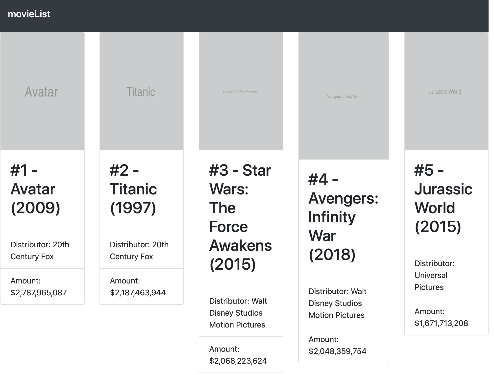

# Ch1. Creating  a Movie List Application in React

## Project overview

In this chapter, we will create a movie list application in React that retrieves data from a local JSON file and runs in the browser with webpack and Babel. Styling will be done using Bootstrap. The application that you'll build will return a list of the highest-grossing movies as of 2019, along with some more details and a poster for every movie.

## Getting started

### Install React Developer Tools plugin

- Chrome Web Store (https://chrome.google.com/webstore)
- Firefox Addons (https://addons.mozilla.org).

## Code Structure

complete code : https://github.com/PacktPublishing/React-Projects/tree/ch1.

```
├── README.md
├── assets
│   └── data.json
├── media
│   ├── avatar.jpg
│   ├── avengers_infinity_war.jpg
│   ├── jurassic_world.jpg
│   ├── star_wars_the_force_awakens.jpg
│   └── titanic.jpg
├── package.json
├── src
│   ├── components
│   │   └── Card
│   │       └── Card.js
│   ├── containers
│   │   └── List.js
│   ├── index.html
│   └── index.js
└── webpack.config.js

```

## Final Screen



## Creating a movie list application

### Setting up a project

```
npm init -y
```

#### Setting up webpack

1. npm install

   ```
   npm install --save-dev webpack webpack-cli
   ```

2. add the start and build scripts to our package.json

   ```
    	"scripts": {
   + 	"start": "webpack --mode development",
   + 	"build": "webpack --mode production",
   ...
   ```

3. Create a new directory inside our project called `src` and create a new file inside this directory called index.js

   ```
   console.log("movieList")
   ```

now run the `npm start` or `npm build` command at our command line, new file built: `dist/main.js` 

```
node dist/main.js
```

#### Configuring webpack to work with React

1. Install these packages 

   ```jinja2
   npm install react react-dom
   ```
   
2. we'll use Babel and its related packages, which can be installed as devDependencies

   ```
   npm install --save-dev @babel/core @babel/preset-env @babel/preset-react babel-loader
   ```

3. to make Babel work with webpack, create a file called `webpack.config.js` 

   ```
   module.exports = {
     module: {
         rules: [
             {
                 test: /\.js$/,
                 exclude: /node_modules/,
                 use: {
                     loader:'babel-loader',
                 },
             },
         ],
        },
   }

	```
   
4. also create the `.babelrc`

   ```
   {
   "presets": [
       [
           "@babel/preset-env",
           {
               "targets": {
                   "node": "current"
               }
           }
       ],
       "@babel/react"
   ]
   }
   ```

   The @babel/preset-env preset has options defined in it that make sure that the compiler uses the latest version of Node.js, so polyfills for features such as async/await will still be available.

#### Rendering a React project

 need to create an actual React component that can be compiled and run.

1. edit the `index.js` 
	```
	import React from 'react';
import ReactDOM from 'react-dom';
	const App = () => {
	    return <h1>movieList</h1>;
	};
	ReactDOM.render(<App />, document.getElementById('root'));
	```
	
2. new file : `src/index.html` 
	```
	<!DOCTYPE html>
	<html lang="en">
	<head>
	    <meta charset="UTF-8">
	    <meta name="viewport" content="width=device-width, initial-scale=1.0">
	    <meta http-equiv="X-UA-Compatible" content="ie=edge">
	    <title>movieList</title>
	</head>
	<body>
	    <section id="root"></section>
	</body>
	</html>
	```

3. extending webpack so that it adds the minified bundle code to the body tags as scripts when running. 				

   ```
   npm install --save-dev html-webpack-plugin
   ```

   Add this new package to the webpack configuration in the webpack.config.js file:

   ```
   + const HtmlWebPackPlugin = require('html-webpack-plugin');
   
   + const htmlPlugin = new HtmlWebPackPlugin({
   +    template: './src/index.html',
   +    filename: './index.html',
   + });
   
   module.exports = {
       module: {
           rules: [
               {
                   test: /\.js$/,
                   exclude: /node_modules/,
                   use: {
                       loader: 'babel-loader',
                   },
               },
           ],
       },
       +  plugins: [htmlPlugin],
   };
   ```

 we've set the entry point of the application as the index.html. file. That way, webpack knows where to add the bundle to the body tag.

```npm start```

webpack will start in development mode and add the index.html file to the dist directory.

open this file in the browser or run

 `open dist/index.html`  

#### Creating a development server

```
npm install --save-dev webpack-dev-server
```

edit the start script in the package.json 

```
{
    "name": "movieList",
    "version": "1.0.0",
    "description": "",
    "main": "index.js",
    "scripts": {
-       "start": "webpack --mode development",
+       "start": "webpack-dev-server --mode development --open",        
        "build": "webpack --mode production"
    },
    "keywords": [],
    "author": "",
    "license": "ISC"

    ...
}
```

which makes sure webpack is restarted every time an update is made to any of your project files.

*To enable hot reloading, replace the* --open *flag with the* --hot *flag. This will only reload files that have been changed instead of the entire project.* 

### Structuring a project

#### Creating new components

current project structure 

```
movieList
|-- dist
    |-- index.html
    |-- main.js
|-- node_modules
|-- src
    |-- index.js
    |-- index.html
.babelrc
package.json
webpack.config.js
```

Restructure project to sample one.

either structuring your files by **feature** or **route** or structuring them by **file type**.

The movie list application will use a hybrid approach, where files are structured by file type first and by feature second. 

1. creating a new subdirectory of `src` called `containers`. create a file called `List.js` in it.

   ```
   import React, { Component } from 'react';
   
   class List extends Component {
       render() {
           return <h1>movieList</h1>;
       }
   };
   
   export default List;
   ```

2. This container should be included in the entry point of our application, include it in the `index.js` file

   ```
   import React from 'react';
   import ReactDOM from 'react-dom';
   + import List from './containers/List';
   
   const App = () => {
   -   return <h1>movieList</h1>;
   +   return <List />;
   };
   
   ReactDOM.render(<App />, document.getElementById('root'));
   ```

3. Our application should have the following file structure:

   ```
   movieList
   |-- dist
       |-- index.html
       |-- main.js
   |-- src
       |-- containers
           |-- List.js
       |-- index.js
       |-- index.html
   .babelrc
   package.json
   webpack.config.js
   ```

4. We need to create a new directory called components inside the src directory, which is where we'll create another new directory called Card. Inside this directory, create a file called Card.js and add the following code block to the empty Card component:

  ```
   import React from 'react';
   const Card = () => {
        return <h2>movie #1</h2>;
    };
  
    export default Card; 
  ```

5. import this Card component into the container for List 

   ```
   import React, { Component } from 'react';
   + import Card from '../components/Card/Card';
   
   class List extends Component {
       render() {
   -       return <h1>movieList</h1>;
   +       return <Card />;
       }
   };
   
   export default List;
   ```

#### Retrieving data

   1. the Card component needs to be prepared to receive this information. 

      ```
      import React from 'react';
      
      const Card = ({ movie }) => {
           return (
              <div>
                  <h2>{`#${movie.ranking} - ${movie.title} (${movie.year})`}</h2>
                  
                  <p>{`Distributor: ${movie.distributor}`}</p>
                  <p>{`Amount: ${movie.amount}`}</p>
              </div>
          );
      };
      
      export default Card;
      ```

   2. adding a constructor function to the List component

      ```
      ...
      
      class List extends Component {+
      +   constructor() {
      +       super()
      +       this.state = {
      +           data: [],
      +           loading: true,
      +       };
      +   }
      
          return (
            ...
      ```

   3.  set up a componentDidMount function,

      ```
      ...
      
      class List extends Component {
      
          ...
      
       +    async componentDidMount() {
       +        const movies = await fetch('../../assets/data.json');
       +        const moviesJSON = await movies.json();
       
       +        if (moviesJSON) {
       +            this.setState({
       +                data: moviesJSON,
       +                loading: false,
       +            });
       +        }
       +    }
      
          return (
            ...
      ```

   4. Pass this state to the Card component

      ```
      class List extends Component {
      
          ...
      
          render() {
       _     return <Card />
       +     const { data, loading } = this.state;
       
      +      if (loading) {
      +         return <div>Loading...</div>
      +      }
       
      +      return data.map(movie => <Card key={ movie.id } movie={ movie } />);
          }
      }
      
      export default List;
      ```

#### Adding styling

1. To use Bootstrap

   ```
   npm install --save-dev bootstrap
   ```

2. import this file into the entry point of our React application, called index.js,

   ```
   import React, { Component } from 'react';
   import ReactDOM from 'react-dom';
   import List from './containers/List';
   + import 'bootstrap/dist/css/bootstrap.min.css';
   
   const App = () => {
       return <List />;
   }
   
   ReactDOM.render(<App />, document.getElementById('root'));
   ```

3. add these packages as a rule to the webpack configuration:

   ```
   const HtmlWebPackPlugin = require('html-webpack-plugin');
   
   const htmlPlugin = new HtmlWebPackPlugin({
       template: './src/index.html',
       filename: './index.html',
   });
   
   module.exports = {
       module: {
           rules: [
               {
                   test: /\.js$/,
                   exclude: /node_modules/,
                   use: {
                       loader: "babel-loader"
                   }
               },
   +           {
   +               test: /\.css$/,
   +               use: ['style-loader', 'css-loader']
   +           }
           ]
       },
       plugins: [htmlPlugin]
   };
   ```

4. changes to the index.js

   ```
   ...
   
   const App = () => {
       return (
   +        <div className='container-fluid'>
               <List />
           </div>
       );
   };
   
   ReactDOM.render(<App />, document.getElementById('root'));
   ```

5. Inside the List component, we need to set the grid to display the Card components, 

   ```
   ...
   
   class List extends Component {
   
       ...
   
       render() {
           const { data, loading } = this.state;
   
           if (loading) {
               return <div>Loading...</div>;
           }
   
            return (
     +         <div class='row'>
                   {data.map(movie =>
     +                 <div class='col-sm-2'>
                           <Card key={ movie.id } movie={ movie } />
     +                 </div>
                   )}
     +          </div>
           );
       }
   }
   
   export default List; 
   ```

6. The code for the Card component is as follows

   ```
   import React from 'react';
   
   const Card = ({ movie }) => {
       return (
           <div className='card'>
               
               <div className='card-body'>
                   <h2 className='card-title'>{`#${movie.ranking} - ${movie.title} (${movie.year})` }</h2>
               </div>
               <ul className='list-group list-group-flush'>
                   <li className='list-group-item'>{`Distributor: ${movie.distributor}`}</li>
                   <li className='list-group-item'>{`Amount: ${movie.amount}`}</li>
               </ul>
           </div>
       );
   };
   
   export default Card;
   ```

7. to add the finishing touches, open the index.js file

   ```
   ...
   
   const App = () => {
       return (
           <div className='container-fluid'>
   _            <h1>movieList</h1>
   +            <nav className='navbar sticky-top navbar-light bg-dark'>
   +               <h1 className='navbar-brand text-light'>movieList</h1>
   +           </nav>
   
               <List />
           </div>
       );
   };
   
   ReactDOM.render(<App />, document.getElementById('root'));
   ```

#### Adding ESLint

1. Install ESLint

   ```
   npm install --save-dev eslint eslint-loader eslint-plugin-react
   ```

2. To configure ESLint, we need to create a file called .eslintrc.js

   ```
   module.exports = {
       "env": {
           "browser": true,
           "es6": true
       },
       "parserOptions": {
           "ecmaFeatures": {
               "jsx": true
           },
           "ecmaVersion": 2018,
           "sourceType": "module"
       },
       "plugins": [
           "react"
       ],
       "extends": ["eslint:recommended", "plugin:react/recommended"]
   };       
   ```

3.  In the webpack.config.js file, add eslint-loader next to babel-loader:

   ```
   ...
   
   module.exports = {
       module: {
           rules: [
               {
                   test: /\.js$/,
                   exclude: /node_modules/,
   +               use: ['babel-loader', 'eslint-loader'] 
               },
               {
                   test: /\.css$/,
                   use: ['style-loader', 'css-loader']
               }
           ]
       },
       plugins: [htmlPlugin]
   };
   ```

When using React, it's recommended that we validate any props we send to components since JavaScript's dynamic type system may lead to situations where variables are undefined or have an incorrect type. Our code will work without us having to validate the props, but to fix this error we have to install the prop-types package, 

1. The package that we use to check for prop types 

   ```
   npm install --save prop-types
   ```

2. Now, we can validate propTypes in our component by importing the package into the Card component and adding the validation to the bottom of this file:

   ```
   import React from 'react';
   + import PropTypes from 'prop-types';
   
   const Card = ({ movie }) => {
       ...
   };
   
   + Card.propTypes = {
   +    movie: PropTypes.shape({}),
   + };
   
   export default Card;
   ```

3. If we look at the command line again, we'll see that the missing propTypes validation error has disappeared.

   ```
   ...
   
   Card.propTypes = {
   _   movie: PropTypes.shape({}),
   +    movie: PropTypes.shape({
   +    title: PropTypes.string,
   +    distributor: PropTypes.string,
   +     year: PropTypes.number,
   +     amount: PropTypes.string,
   +     img: PropTypes.shape({
   +       src: PropTypes.string,
   +       alt: PropTypes.string
   +     }),
   +     ranking: PropTypes.number
   +   }).isRequired  
   };  
   ```

 *We can run the eslint --init command to create custom settings, but using the preceding settings is recommended, so that we ensure the stability of our React code.*

 - `env` field sets the actual environment our code will run in and will use es6 functions in it
 - `parserOptions` field adds extra configuration for using jsx and modern JavaScript.
 - `plugins` field, which is where we specify that our code uses react as a framework.
 - `extends` field is where the recommended settings for eslint are used, as well as framework-specific settings for React.

 To configure ESLint, create a file `.eslintrc.js` in the project's root directory:

 - `eslint` is the core package and helps us identify any potentially problematic patterns in our JavaScript code.
 - `eslint-loader` is used by Webpack to run ESLint every time we update our code.
 - `eslint-plugin-react` adds specific rules to ESLint for React applications.

 to make sure our code meets certain standards, for instance, that our code follows the correct JavaScript patterns.

## Further reading

- [Thinking in React]()(https://reactjs.org/docs/thinking-in-react.html)
- [Bootstrap https][2]([https://getbootstrap.com/docs/4.3/getting-started/introduction/][3])
- [ESLint][4] https://eslint.org/docs/user-guide/getting-started

[2]: https://getbootstrap.com/docs/4.3/getting-started/introduction/
[3]: https://getbootstrap.com/docs/4.3/getting-started/introduction/
[4]: https://eslint.org/docs/user-guide/getting-started