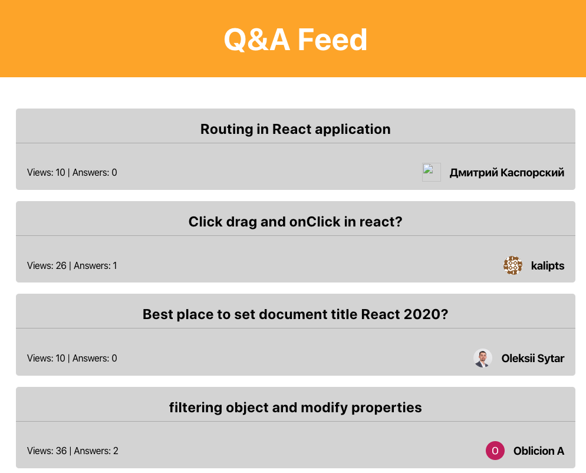
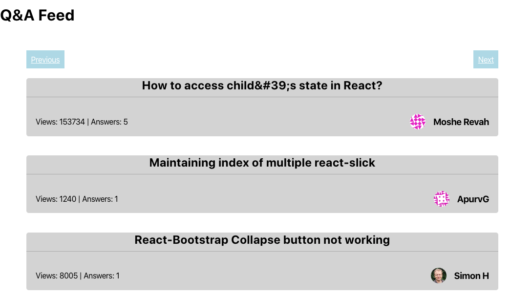

# My-React-Projects

My works for React-Projects book

# Ch4. Build a SSR-Based Community Feed Using React Router

will be covered in this chapter:

- React Suspense and code-splitting
- Using HOC (**Higher-Order Components**)
- Dynamic data flow

In this chapter, you'll add declarative routing to a Create React App using react-router and have components dynamically loaded from the server instead of the browser. To enable SSR, the React feature, Suspense, will be used with ReactDOMServer. If you're interested in **Search Engine Optimization** (**SEO**), this chapter will use React Helmet to add metadata to the page so your application can be better indexed by search engines.

The following topics will be covered in this chapter:

- Declarative routing
- Server-side rendering
- SEO in React

## Project overview

we will create a PWA with declarative routing using react-router that supports SSR and therefore is loaded from the server rather than the browser. Also, the application is optimized for search engines using React Helmet.

### Getting started

this project uses the publicly available Stack Overflow API to fill the application with data. 

initial source code: https://github.com/PacktPublishing/React-Projects/tree/ch4-initial. 

The complete source code: https://github.com/PacktPublishing/React-Projects/tree/ch4. 

More information about this API can be found at: https://api.stackexchange.com/docs/questions#order=desc&sort=hot&tagged=reactjs&filter=default&site=stackoverflow&run=true.

As the project is set up as a PWA, the service workers are registered to make it possible to visit the application even when there is no internet connection. You can check this by running npm run build first and serve -s build once the build process is completed. The build version of the application can now be visited at http://localhost:5000.

http://localhost:3000



## Code structure

```
.
├── README.md
├── package.json
├── public
│   ├── favicon.ico
│   ├── index.html
│   └── manifest.json
├── server
│   ├── index.js
│   └── server.js
└── src
    ├── components
    │   ├── App
    │   │   └── Header.js
    │   └── Feed
    │       ├── Card.js
    │       └── Owner.js
    ├── containers
    │   ├── App.js
    │   ├── Feed.js
    │   └── Question.js
    ├── index.js
    ├── serviceWorker.js
    └── withDataFetching.js
```

### Community feed application

you'll build a community feed application with declarative routing that has SSR enabled. For SEO, a package called React Helmet will be used. In this community feed, you can see an overview of recent questions on Stack Overflow that have the reactjs tag, and click on them to see more information and the answers. 

#### Declarative routing

With the `react-router` package, you can add declarative routing to a React application, just by adding components. These components can be divided into three types: 

- router components
- route matching components
- navigation components

Setting up routing with react-router 

1. install `react-router`

   ```
   npm install react-router-dom
   ```

2. import the routing and route matching components, update `src/containers/App.js`:

   ```
   import React, { Component } from 'react';
   import styled, { createGlobalStyle } from 'styled-components';
   + import { BrowserRouter as Router, Route } from 'react-router-dom';
   import Header from '../components/Header/Header';
   ...
   ```

3. wrapped in a routing component:

   ```
   ...
   class App extends Component {
     render() {
       return (
           <>
             <GlobalStyle />
             <AppWrapper>
               <Header />
   +           <Router>
   +             <Route path='/' component={Feed} />
   +           </Router>
             </AppWrapper>
           </>
       );
     }
   }
   ...
   ```

4. add the exact attribute to `Route`:

   ```
   ...
   class App extends Component {
     render() {
       return (
           <>
             <GlobalStyle />
             <AppWrapper>
               <Header />
               <Router>
   -             <Route path='/' component={Feed} />
   +             <Route exact path='/' component={Feed} />
               </Router>
             </AppWrapper>
           </>
       );
     }
   }
   ```

Now, you shouldn't be able to see the Feed component being rendered if you visit any route other than /.

##### Routes with parameters

the path matches /question/:id, where id stands for the ID of the question that is clicked on from the feed:

1. Create a new class component `src/containers/Question.js`:

   ```
   import React, { Component } from 'react';
   import styled from 'styled-components';
   
   const QuestionWrapper = styled.div`
     display: flex;
     justify-content: space-between;
     flex-direction: column;
     margin: 5%;
   `;
   
   const Alert = styled.div`
     text-align: center;
   `;
   
   class Question extends Component {
     constructor() {
       super();
       this.state = {
         data: [],
         loading: true,
         error: '',
       };
     }
   
     render() {
       const { data, loading, error } = this.state;
   
       if (loading || error) {
         return <Alert>{loading ? 'Loading...' : error}</Alert>;
       }
   
       return (
         <QuestionWrapper></QuestionWrapper>
       );
     }
   }
   
   export default Question;
   ```

2. To make this route available, import `Question` component inside the `App`:

   ```
   import React, { Component } from 'react';
   import styled, { createGlobalStyle } from 'styled-components';
   import { BrowserRouter as Router, Route } from 'react-router-dom';
   import Header from '../components/Header/Header';
   import Feed from './Feed';
   + import Question from './Question';
   ...
   class App extends Component {
     render() {
       return (
           <>
             <GlobalStyle />
             <AppWrapper>
               <Header />
               <Router>
                 <Route exact path='/' component={Feed} />
   +             <Route path='/questions/:id' component={Question} />
               </Router>
             </AppWrapper>
           </>
       );
     }
   }
   ```

    If you now visit http://localhost:3000/questions/55366474, the Loading... message will be displayed as no data fetching is implemented yet.

To implement data fetching on the Question component, 

1. update `Question`, which fetches the API using this parameter:

   ```
   ...
   
   + const ROOT_API = 'https://api.stackexchange.com/2.2/';
   
   class Question extends Component {
     constructor(props) { ... }
   
   + async componentDidMount() {
   +   const { match } = this.props;
   +   try {
   +     const data = await fetch(
   +       `${ROOT_API}questions/${match.params.id}?site=stackoverflow`,
   +     );
   +     const dataJSON = await data.json();
   
   +     if (dataJSON) {
   +       this.setState({
   +         data: dataJSON,
   +         loading: false,
   +       });
   +     }
   +   } catch(error) {
   +     this.setState({
   +       loading: true,
   +       error: error.message,
   +     });
   +   }
   + }
   
     render() {
       ...
   ```

2. Display data inside a `Card` component in the `Question`:

   ```
   import React, { Component } from 'react';
   import styled from 'styled-components';
   + import Card from '../components/Feed/Card';
   
   ...
   
   class Question extends Component {
     ...
     render() {
       const { data, loading, error } = this.state;
   
       if (loading || error) {
         return <Alert>{loading ? 'Loading...' : error}</Alert>;
       }
   
       return (
         <QuestionWrapper>
   +       <Card key={data.items[0].question_id} data={data.items[0]} />
         </QuestionWrapper>
       );
     }
   }
   
   export default Question;
   ```

If you now visit http://localhost:3000/questions/55366474,  a Card component showing information, To be able to navigate to this page from the Feed component, a Link navigation should be added to wrap Card:

```
import React, { Component } from 'react';
import styled from 'styled-components';
+ import { Link } from 'react-router-dom';
import Card from '../components/Card/Card';

...

class Feed extends Component {
  ...
  render() {
    const { data, loading, error } = this.state;

    if (loading || error) {
      return <Alert>{loading ? 'Loading...' : error}</Alert>;
    }

    return (
      <FeedWrapper>   
        {data.items.map(item =>
+         <Link key={item.question_id} to={`/questions/${item.question_id}`}>
-            <Card key={item.question_id} data={item} />
+            <Card data={item} />
+          </Link>
+        )}
       </FeedWrapper>
     );
   }
}
...
```

 fix Link styling changes to `Feed`:

```
...
+ const CardLink = styled(Link)`
+  text-decoration: none;
+  color: inherit;
+ `;

const ROOT_API = 'https://api.stackexchange.com/2.2/';

class Feed extends Component {
  ...
  render() {
    const { data, loading, error } = this.state;

    if (loading || error) {
      return <Alert>{loading ? 'Loading...' : error}</Alert>;
    }

    return (
      <FeedWrapper>
        {data.items.map(item => (
-         <Link key={item.question_id} to={`/questions/${item.question_id}`}>
+         <CardLink key={item.question_id} to={`/questions/${item.question_id}`}>
            <Card data={item} />
-         </Link>
+         </CardLink>
        ))}
      </FeedWrapper>
    );
  }
}
...
```

##### Handling query strings

it would be a good idea to move the overview of all of the questions to another route that is called /questions.

 in `App` component:

```
...
class App extends Component {
  render() {
    return (
       <>
         <GlobalStyle />
         <AppWrapper>
           <Header />
           <Router>
             <Route exact path='/' component={Feed} />
+            <Route path='/questions' component={Feed} />
             <Route path='/questions/:id' component={Question} />
           </Router>
          </AppWrapper>
        </>
     );
   }
 }
```

need to add a Switch route matching component, which works as a switch statement and will render the first Route that matches the current locationn, in `scr/containers/App.js`:

```
import React, { Component } from 'react';
import styled, { createGlobalStyle } from 'styled-components';
- import { BrowserRouter as Router, Route } from 'react-router-dom';
+ import { BrowserRouter as Router, Route, Switch } from 'react-router-dom';
...
				<AppWrapper>
          <Header />
          <Router>
+         <Switch>
            <Route exact path='/' component={Feed} />
-           <Route path='/questions' component={Feed} />
            <Route path='/questions/:id' component={Question} />
+           <Route path='/questions' component={Feed} />
+         </Switch>
          </Router>
        </AppWrapper>
...        
```

##### Add Pagination

the next step is to add the pagination. 

the object that is being returned has a field called has_more.  If this field has the value true, which means you can request more questions by adding the page query string to the API request.

http://localhost:3000/questions?page=2. This query string is now available as a prop on the Feed component in the location object under the search field,

to grasp the value of the location.search prop. Therefore, you need to install the query-string package using npm:

```
npm install query-string
```

to parse a query string, in this case, location.search, 

1. importing the package in the `Feed` component:

```
import React, { Component } from 'react';
import styled from 'styled-components';
+ import queryString from 'query-string';
...
class Feed extends Component {
- constructor() {
-   super();
+ constructor(props) {
+   super(props);
+   const query = queryString.parse(props.location.search);
    this.state = {
      data: [],
+     page: (query.page) ? parseInt(query.page) : 1,
      loading: true,
      error: '',
    };
}
...
async componentDidMount() {
+ const { page } = this.state;
  try {
-   const data = await fetch(
-     `${ROOT_API}questions/${match.params.id}?site=stackoverflow`,
-   );
+   const data = await fetch(
+     `${ROOT_API}questions?order=desc&sort=activity&tagged=reactjs&site=stackoverflow${(page) ? `&page=${page}` : ''}`,
+   );
    const dataJSON = await data.json();
```

 can test whether this is working by changing the query string for pagewith different numbers, such as http://localhost:3000/questions?page=1or http://localhost:3000/questions?page=3. 

2. let's add pagination buttons to the bottom of the page:

```
...

+ const PaginationBar = styled.div`
+  width: 100%;
+  display: flex;
+  justify-content: space-between;
+ `;

+ const PaginationLink = styled(Link)`
+  padding: 1%;
+  background: lightBlue;
+  color: white;
+  text-decoration: none
+  border-radius: 5px;
+ `;

const ROOT_API = 'https://api.stackexchange.com/2.2/';

class Feed extends Component {
  ...
        <FeedWrapper>
        {data.items.map(item => (
          <CardLink key={item.question_id} to={`/questions/${item.question_id}`}>
            <Card data={item} />
          </CardLink>
        ))}
+       <PaginationBar>
+         <PaginationLink>Previous</PaginationLink>
+         <PaginationLink>Next</PaginationLink>
+       </PaginationBar>
      </FeedWrapper>
```

add function and constrains to page link:

```
...

render() {
- const { data, loading } = this.state;  
+ const { data, page, loading } = this.state;
+ const { match } = this.props;

  if (loading || error) {
    return <Alert>{loading ? 'Loading...' : error}</Alert>;
  }

  return (
    <FeedWrapper>
      {data.items.map(item => (
        <CardLink key={item.question_id} to={`/questions/${item.question_id}`}>
          <Card data={item} />
        </CardLink>
      ))}
      <PaginationBar>
-       <PaginationLink>Previous</PaginationLink>
-       <PaginationLink>Next</PaginationLink>
+       {page > 1 && <PaginationLink to={`${match.url}?page=${page - 1}`}>Previous</PaginationLink>}
+       {data.has_more && <PaginationLink to={`${match.url}?page=${page + 1}`}>Next</PaginationLink>}
      </PaginationBar>
     </FeedWrapper>
    );
  }
}
```

To watch for any changes to props or state when your application is already mounted, you need to use another life cycle method called componentDidUpdate. 

```
...
+ async fetchAPI(page) {
+   try {
+     const data = await fetch(`${ROOT_API}questions?order=desc&sort=activity&tagged=reactjs&site=stackoverflow${(page) ? `&page=${page}` : ''}`);
+     const dataJSON = await data.json();
+
+     if (dataJSON) {
+       this.setState({
+         data: dataJSON,
+         loading: false,
+       });
+     }
+   } catch(error) {
+     this.setState({
+      loading: false,
+      error: error.message,
+    });
+  }
+ }

async componentDidMount() {
  ...
```

```
- async componentDidMount() { ... }

+ componentDidMount() {
+  const { page } = this.state;
+  this.fetchAPI(page);
+ }

render() {
```

```
...  
componentDidMount() {
  const { page } = this.state;
  this.fetchAPI(page);
}

+ componentDidUpdate(prevProps) {
+  if (prevProps.location.search !== this.props.location.search) {
+    const query = queryString.parse(this.props.location.search);
+    this.setState({ page: parseInt(query.page) }, () => 
+      this.fetchAPI(this.state.page),
+    );
+  }
+ }

render() {
...
```

You have now implemented the parsing of the query string to dynamically change the route for your application.

#### Enable SSR

##### Creating an express server with react-router

There is no standard pattern to enable SSR for your React application, but the starting point is to create a `Node.js` server. `react-router` and `styled-components`, can work with SSR as well:

1. install express:

   ```
   npm install express
   ```

2. create a new directory `server` in the projects' root directory and place a new file called `server.js`:

   ```
   import path from 'path';
   import fs from 'fs';
   import express from 'express';
   import React from 'react';
   import ReactDOMServer from 'react-dom/server';
   ```

3. import the entry point of the application 

   ```
   ...
   import ReactDOMServer from 'react-dom/server';
   
   + import App from '../src/containers/App';
   ```

4. Setpu express,

   getting the contents of the index.html 

   ```
   ...
   const PORT = 8080;
   const app = express();
   const router = express.Router()
   
   const serverRenderer = (req, res, next) => {
     const indexFile = path.resolve('./build/index.html');
     fs.readFile(indexFile, 'utf8', (err, data) => {
       if (err) {
         console.error('Something went wrong:', err);
         return res.status(500).send('Oops, better luck next time!');
       }
   
       const header = ReactDOMServer.renderToString(<Header />);
   	  const app = ReactDOMServer.renderToString(<App />);
   
       data = data.replace('<div id="root"></div>', `<div id="root">${header}${app}</div>`);
   
       return res.send(data);
     });
   });
   
   router.use('^/$', serverRenderer)
   
   router.use(
       express.static(path.resolve(__dirname, '..', 'build'), { maxAge: '30d' })
   )
   
   // tell the app to use the above rules
   app.use(router)
   
   app.listen(PORT, () => {
     console.log(`Server-Side Rendered application running on port ${PORT}`);
   });
   ```

5. Change  `src/index.js`:

   ```
   - ReactDOM.render(<App />, document.getElementById('root'));
   + ReactDOM.hydrate(<App />, document.getElementById('root'));
   ```

you need to configure Babel for the server directory and install some of the Babel packages. 

1. install Babel packages:

   ```
   npm install @babel/polyfill @babel/register @babel/preset-env @babel/preset-react
   ```

   - `@babel/polyfill`, which compiles functions such as async/await; 
   - `@babel/register` to tell Babel it should transform files with the .js extension;  
   - `@babel/preset-env` and `@babel/preset-react` to configure Babel to work with React

2. Create a new file `/server/index.js`and have this file serve as an entry point to the server.js file:

   ```
   require('@babel/polyfill');
   
   require('@babel/register')({
     presets: ['@babel/preset-env', '@babel/preset-react'],
   });
   
   require('./server');
   ```

3. make a shortcut for this command in `package.json` to execute the node `server/index.js`:

   ```
   ...  
   "scripts": {
     "start": "react-scripts start",
     "build": "react-scripts build",
     "test": "react-scripts test",
     "eject": "react-scripts eject",
   +  "ssr": "node server/index.js"
   },
   ```

 If you run the `npm run build && npm run ssr` command now, though, you will receive an error saying BrowserRouter needs to a DOM to render. 

Because you need to use the StaticRouter component when using SSR instead of BrowserRouter:

1. update `src/index.js`:

   ```
   import React from 'react';
   import ReactDOM from 'react-dom';
   + import { BrowserRouter as Router } from 'react-router-dom';
   import App from './containers/App';
   import * as serviceWorker from './serviceWorker';
   
   ReactDOM.hydrate(
   +  <Router>
        <App />
   +  </Router>,
     document.getElementById('root'),
     ...
   ```

2. And, of course, it's deleted from the `App` component:

   ```
   ...
   import styled, { createGlobalStyle } from 'styled-components';
   - import { BrowserRouter as Router, Route, Switch } from 'react-router-dom';
   + import { Route, Switch } from 'react-router-dom';
   ...
    <AppWrapper>
             <Header />
   -         <Router>
             <Switch>
               <Route exact path='/' component={Feed} />
               <Route path='/questions/:id' component={Question} />
               <Route path='/questions' component={Feed} />
             </Switch>
   -         </Router>
           </AppWrapper>
     ...      
   ```

3. To get the Node.js server to now use the StaticRouter component, update to `server/server.js`:

   ```
   import ReactDOMServer from 'react-dom/server';
   + import { StaticRouter as Router} from 'react-router-dom';
   ...
     const app = ReactDOMServer.renderToString(
   +   <Router location={req.url} context={context}>
         <App />
   +   </Router>,
   ...
   ```

    you can go and execute `npm run build` and start the Node.js server by running `npm run ssr` to view your server-rendered React application on http://localhost:8080. 

   Another advantage of SSR is that your application can be discovered by search engines more effectively.



##### Adding head tags using React Helmet

Assuming you want your application to be indexed by search engines, you need to set head tags for the crawlers to identify the content on your page. This is something you want to do dynamically for each route route, as each route will have different content. A popular package for setting these head tags in React applications is React Helmet, which has support for SSR. You can install React Helmet with npm:

```
npm install react-helmet
```

React Helmet can define the head tags in any component that is rendered by your application, and if nested, the lowest definition of a Helmet component in the component tree will be used. That's why you can create a Helmet component in your Header component for all routes and in each of the components that are being rendered on a route, you can overwrite these tags:

1. `src/components/App/Header.js`, create a Helmet component that sets title and meta description:

   ```
   import React from 'react';
   import styled from 'styled-components';
   + import Helmet from 'react-helmet';
   ...
   const Header = () => (
   +  <>
   +    <Helmet>
   +      <title>Q&A Feed</title>
   +      <meta name='description' content='This is a Community Feed project build with React' />
   +    </Helmet>
       <HeaderWrapper>
             <Title>Q&A Feed</Title>
       </HeaderWrapper>
   +  </>
   ```

2. create a Helmet component in `src/containers/Feed.js` that only sets a title for this route:

   ```
   import { Link } from 'react-router-dom';
   + import Helmet from 'react-helmet';
   import Card from '../components/Card/Card';
     ...
     render() {
       const { data, page, loading, error } = this.state;
       const { match } = this.props;
   
       if (loading || error) {
         return( 
   +       <>
   +         <Helmet>
   +           <title>Q&A Feed - Questions</title>
   +         </Helmet>
             <Alert>{loading ? 'Loading...' : error}</Alert>
   +       </>
   			)
       }
   ```

3. Do the same for the `src/containers/Question.js`, take the ID of the question from the match props to make the page title more dynamic

   ```
   import React, { Component } from 'react';
   import styled from 'styled-components';
   + import Helmet from 'react-helmet';
   import Card from '../components/Card/Card';
     ...
     render() {
   +   const { match } = this.props;
       const { data, loading, error } = this.state;
   
       if (loading || error) {
         return 
   +       <>
   +         <Helmet>
   +           <title>{`Q&A Feed - Question #${match.params.id}`}</title>
   +         </Helmet>
             <Alert>{loading ? 'Loading...' : error}</Alert>
   +       </>
       }
   ...
   ```

4. But to support SSR, React Helmet should also be configured on the Node.js server. use the Helmet.renderStatic method, which transforms the Helmet components in your code the same way as ReactDOMserver.renderToString does for other components. Open the server/server.js:

   ```
   import { StaticRouter as Router } from 'react-router-dom';
   + import Helmet from 'react-helmet';
   ...
   +  const helmet = Helmet.renderStatic();
     const indexFile = path.resolve('./build/index.html');
     ...
     data = data.replace('<div id="root"></div>', `<div id="root">${app}</div>`);
   +   data = data.replace('<meta name="helmet"/>', `${helmet.title.toString()}${helmet.meta.toString()}`);
   
       return res.send(data);
   ```

5. change `public/index.html`:

   ```
   ...
   <link rel="manifest" href="%PUBLIC_URL%/manifest.json" />
   +   <meta name="helmet" />
   -   <title>React App</title>
     </head>
   ...
   ```

now run `npm run build` again, then `npm run ssr` command to start the Node.js server and visit your React SSR application in the browser on http://localhost:8080.

# Summary

In this chapter, you've added dynamic routing to a Create React App using react-router, making it possible for users to open your application on a specific page. By using the React feature Suspense, components are loaded dynamically on the client-side. This way, you lower the amount of time before your user first gets in contact with your application. The project you created in this chapter also supports SSR, and React Helmet is used to add dynamic head tags to the application for SEO purposes.

After completing this chapter, you must already feel like an expert with React! The next chapter will for sure take your skill to the next level as you'll learn how to handle state management using the context API. With the context API, you can share state and data between multiple components in your application, no matter whether they're direct children of the parent component or not.

# Further reading

- React Helmet: https://github.com/nfl/react-helmet
- ReactDOMServer: https://reactjs.org/docs/react-dom-server.html

 