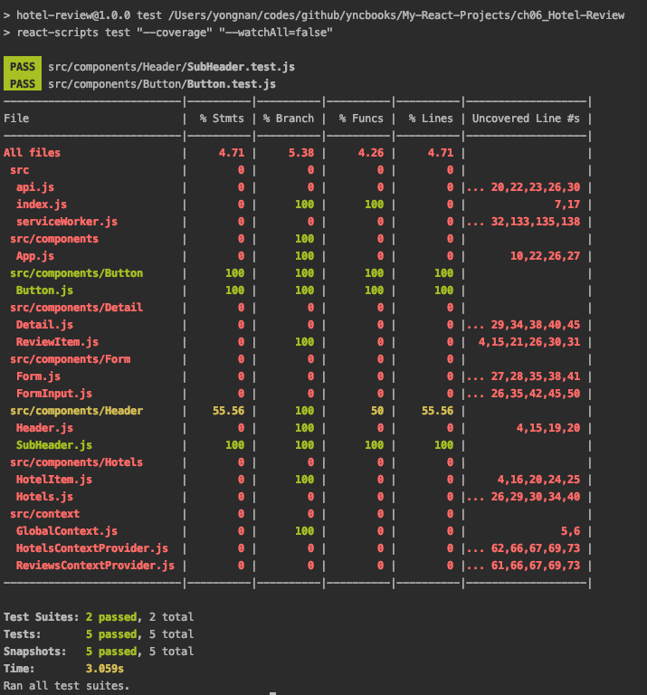

# Build an Application Exploring TDD Using Jest and Enzyme

implementing a **test-driven development** (**TDD**)

The following topics will be covered in this chapter:

- Unit testing with Jest
- Rendering React components for testing
- Testing with Enzyme

**Jest**, which is maintained by Facebook itself and ships with Create React App.

**Enzyme**, which has more functionality than Jest and can be used to test entire life cycles within your components. 

## Unit testing with Jest

 it's looking for JavaScript or JSX files in directories called __tests__ in your project and files that have the **spec** or **test** suffix.

### Rendering a React component for testing

```
npm install react-test-renderer --save-dev
```

```
npm run test 
```

>Watch Usage
 › Press a to run all tests.
 › Press f to run only failed tests.
 › Press q to quit watch mode.
 › Press p to filter by a filename regex pattern.
 › Press t to filter by a test name regex pattern.
 › Press Enter to trigger a test run.
 PASS  src/components/Header/SubHeader.test.js
the <SubHeader /> component
  ✓ should render (1ms)
    ✓ should render with a dynamic title (1ms)
    ✓ should render with a goback button (1ms)
    ✓ should render with a form button
    Test Suites: 1 passed, 1 total
Tests:       4 passed, 4 total
Snapshots:   4 passed, 4 total
Time:        0.142s, estimated 1s
Ran all test suites related to changed files.
Watch Usage: Press w to show more.

```
npm run test --coverage
or 
	yarn test --coverage
or
	CI=true yarn test --coverage 
or 
 	npm run test -- --coverage --watchAll=false
```

PASS src/components/Header/SubHeader.test.js
----------------------------|----------|----------|----------|----------|-------------------|

File | % Stmts | % Branch | % Funcs | % Lines | Uncovered Line #s |
----------------------------|----------|----------|----------|----------|-------------------|
All files | 5 | 6.74 | 4.26 | 5.21 | |
 src | 0 | 0 | 0 | 0 | |
  api.js | 0 | 0 | 0 | 0 |... 20,22,23,26,30 |
  index.js | 0 | 100 | 100 | 0 | 1,2,3,4,5,17 |
  serviceWorker.js | 0 | 0 | 0 | 0 |... 23,130,131,132 |
 src/components | 0 | 100 | 0 | 0 | |
  App.js | 0 | 100 | 0 | 0 |... ,8,10,22,26,27 |
 src/components/Button | 0 | 100 | 0 | 0 | |
  Button.js | 0 | 100 | 0 | 0 | 20 |
 src/components/Detail | 0 | 0 | 0 | 0 | |
  Detail.js | 0 | 0 | 0 | 0 |... 26,27,31,33,35 |
  ReviewItem.js | 0 | 100 | 0 | 0 |... 15,21,26,30,31 |
 src/components/Form | 0 | 0 | 0 | 0 | |
  Form.js | 0 | 0 | 0 | 0 |... 29,30,31,34,36 |
  FormInput.js | 0 | 0 | 0 | 0 |... 17,26,35,40,41 |
 src/components/Header | 100 | 100 | 100 | 100 | |
  Header.js | 100 | 100 | 100 | 100 | |
  SubHeader.js | 100 | 100 | 100 | 100 | |

### Testing components with assertions

`src/components/Button/Button.test.js`

```
npm run test -- --coverage --watchAll=false
```
to supress a message noting 1 snapshot obsolete is shown.
```
npm run test -- --coverage --watchAll=false -u
```



## Using Enzyme for testing React

### Shallow rendering with Enzyme

Enzyme is an open source JavaScript testing library that was created by **Airbnb**

and works with almost every JavaScript library or framework.  

you can also shallow render components to test the first level of the component, as well as render nested components, 

and simulate life cycles for integration tests.

```
npm install enzyme enzyme-adapter-react-16 --save-dev
```

setup file `src/setupTest.js`

With the installation of Enzyme, you can no longer use the test scenarios that use react-test-renderer. 

Enzyme's shallow render has a better understanding of the exports from styled-components and no longer renders those components as a ForwardRef component.

### Testing assertions with shallow rendering

also test 'onClick' event on <Button />

## Integration testing with Enzyme

 with Enzyme, to mount components.

 enable lifecycles and test larger components.

to test multiple components at once, this is called integration testing.

## Further reading

- Enzyme shallow rendering: https://airbnb.io/enzyme/docs/api/shallow.html
- Enzyme mount: https://airbnb.io/enzyme/docs/api/mount.html