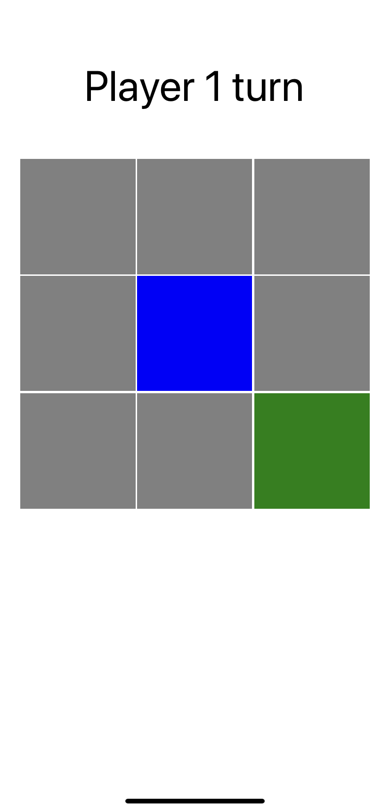

# Ch09. Build an Animated Game Using React Native and Expo

when building a mobile application is that your users expect **animations** and **gestures**

using the Animated API from React Native, a package called `Lottie`, and Expo's `GestureHandler`. 

To create this game, the following topics will be covered:

- Using the React Native Animated API
- Advanced animations with Lottie
- Handling native gestures with Expo

## Getting started

The project that we'll create in this chapter builds upon an initial version that you can find on GitHub: https://github.com/PacktPublishing/React-Projects/tree/ch9-initial[. The complete source code can also be found on GitHub: ](https://github.com/PacktPublishing/React-Projects/tree/ch10-initial)[https://github.com/PacktPublishing/React-Projects/tree/ch9.](https://github.com/PacktPublishing/React-Projects/tree/ch9)


in your ~/.bash_profile or ~/.bash_rc file:

```
export ANDROID_SDK=ANDROID_SDK_LOCATION
export PATH=ANDROID_SDK_LOCATION/platform-tools:$PATH
export PATH=ANDROID_SDK_LOCATION/tools:$PATH
```

## Checking out the initial project

```
npm install && npm start
```

## Creating an animated

### Using the React Native Animated API

you can create animations for **View**, **Text**, **Image**, and **ScrollView** components from react-native by default.

you can use the **createAnimatedComponent** method to create your own.

#### Creating a basic animation

1.  new file in the `src/Components/Slot/Filled.js`. 

   ```
   import React from 'react';
   import { View } from 'react-native';
   
   const Filled = ({ filled }) => {
     return (
       <View
           style={{
               position: 'absolute',
               display: filled ? 'block' : 'none',
               width: '100%',
               height: '100%',
               backgroundColor: filled === 1 ? 'blue' : 'green',
           }}
       />
     );
   }
   
   export default Filled;
   ```

2. import `Filled` to `Slot`

   ```
   import React from 'react';
   import { TouchableOpacity, Dimensions } from 'react-native';
   import styled from 'styled-components/native';
   + import Filled from './Filled';
   
   const SlotWrapper = styled(TouchableOpacity)`
       width: ${Dimensions.get('window').width * 0.3};
       height: ${Dimensions.get('window').width * 0.3};
   -   background-color: ${({ filled }) => filled ? (filled === 1 ? 'blue' : 'green') : 'grey'};
   +   background-color: grey;
       border: 1px solid #fff;
   `;
   
   const Slot = ({ index, filled, handleOnPress }) => (
   - <SlotWrapper filled={filled} onPress={() => !filled && handleOnPress(index)} />
   + <SlotWrapper onPress={() => !filled && handleOnPress(index)}>
   +   <Filled filled={filled} /> 
   + </SlotWrapper>
   );
   
   export default Slot;
   ```

3. need to change the clickable element from a `TouchableOpacity` element to a `TouchableWithoutFeedback` element first

   ```
   import React from 'react';
   - import { TouchableOpacity, Dimensions } from 'react-native';
   + import { TouchableWithoutFeedback, View, Dimensions } from 'react-native';
   import styled from 'styled-components/native';
   import Filled from './Filled';
   
   - const SlotWrapper = styled(TouchableOpacity)`
   + const SlotWrapper = styled(View)`
       width: ${Dimensions.get('window').width * 0.3};
       height: ${Dimensions.get('window').width * 0.3};
       background-color: grey;
       border: 1px solid #fff;
   `;
   
   const Slot = ({ index, filled, handleOnPress }) => (
   - <SlotWrapper onPress={() => !filled && handleOnPress(index)}>
   + <TouchableWithoutFeedback onPress={() => !filled && handleOnPress(index)}>
   +   <SlotWrapper>
         <Filled filled={filled} />
       </SlotWrapper>
   + <TouchableWithoutFeedback>
   );
   
   export default Slot;
   ```

4. To recreate this transition

   ```
   import React from 'react';
   - import { View } from 'react-native';
   + import { Animated, View } from 'react-native';
   
   const Filled = ({ filled }) => {
     return (
       ...
   ```

5. specifying a value that should be changed during the animation that we created with the Animated API.

   ```
   import React from 'react';
   import { Animated, View } from 'react-native';
   
   const Filled = ({ filled }) => {
   + const [opacityValue] = React.useState(new Animated.Value(0));
    
     return (
       ...
   ```

6. add a life cycle method

   ```
   import React from 'react';
   import { Animated, View } from 'react-native';
   
   const Filled = ({ filled }) => {
     const [opacityValue] = React.useState(new Animated.Value(0));
    
   +  React.useEffect(() => {
   +    filled && Animated.timing(
   +        opacityValue, 
   +        {
   +            toValue: 1,
   +            duration: 500,
   +        }
   +    ).start();
   +  }, [filled]);
   
   return (
       <View
           style={{
               position: 'absolute',
    -          display: filled ? 'block' : 'none',
               width: '100%',
               height: '100%',
               backgroundColor: filled === 1 ? 'blue' : 'green',
           }}
       />
    );
   }
   ```

7.  need to change the View element into an Animated.View element 

   ```
   import React from 'react';
   - import { Animated, View } from 'react-native';
   + import { Animated } from 'react-native';
   
   const Filled = ({ filled }) => {
   
   ...
   
   return (    
   -   <View
   +   <Animated.View
           style={{
               position: 'absolute',
               width: '100%',
               height: '100%',
               backgroundColor: filled === 1 ? 'blue : 'green',
   +           opacity: opacityValue,
           }}
       />
     );
   }
   
   export default Filled;
   ```

8.  to make the animation appear smoother, add `Easing`

   ```
   import React from 'react';
   - import { Animated } from 'react-native';
   + import { Animated, Easing } from 'react-native';
   
   const Filled = ({ filled }) => {
     const [opacityValue] = React.useState(new Animated.Value(0));
    
     React.useEffect(() => {
       filled && Animated.timing(
           opacityValue, 
           {
               toValue: 1,
               duration: 1000,
   +           easing: Easing.linear(),
           }
       ).start();
     }, [filled]);
   
     return (
       ...
   ```



#### Combining animations with the Animated API

1. Add `src/Screens/Game.js`

   ```
   import Actions from '../Components/Actions/Actions';
   import Player from '../Components/Player/Player';
   import checkSlots from '../utils/checkSlots';
   import { AppContext } from '../context/AppContext';
   
   + export const ANIMATION_DURATION = 1000;
   
   ...
   ```

2. wrap the functions that set the winner in a setTimeout function

   ```
   ...
   const checkWinner = (player) => {
     const slots = state[`player${player}`];
   
     if (slots.length >= 3) {
       if (checkSlots(slots)) {
   +     setTimeout(() => {
           setWinner(player);
           setPlayerWins(player);
   +     }, ANIMATION_DURATION);
       }
     }
   
     return false;
   }
   ```

3. import this constant in the `src/Components/Slot/Filled.js` 

   ```
   import React from 'react';
   import { Animated, Easing } from 'react-native';
   + import { ANIMATION_DURATION } from '../../Screens/Game';
   
   const Filled = ({ filled }) => {
       const [opacityValue] = React.useState(new Animated.Value(0));
       const [scaleValue] = React.useState(new Animated.Value(0));
   
       React.useEffect(() => {
         filled && Animated.parallel([
           Animated.timing(
             opacityValue,
             {
               toValue: 1,
   -           duration: 1000,
   +           duration: ANIMATION_DURATION,
               easing: Easing.linear(),
   ```

### Advanced animations with Lottie

Since Lottie is still part of Expo's experimental features, you can use it by retrieving it from the DangerZonenamespace.

When using Lottie, you don't have to create these After Effects animations yourself; there's a whole library full of resources that you can customize and use in your project. This library is called LottieFiles and is available at https://lottiefiles.com/.

to add more advanced animations would be the screen that is displayed when either of the players wins the game.

1. install lottie

   ```
   npm install lottie-react-native
   ```

2. For winner: new file `src/Components/Winner/Winner.js`

   ```
   import React from 'react';
   import Lottie from 'lottie-react-native';
   
   const Winner = () => ();
   
   export default Winner;
   ```

3. The imported Lottie component can render any Lottie file that you either create yourself or that is download from the LottieFiles library.

   ```
   const Winner = () => (
   +    <Lottie
   +        autoPlay
   +        style={{
   +            width: '100%',
   +            height: '100%',
   +        }}
   +        source={require('../../assets/winner.json')}
   +    />
   );
   
   export default Winner;
   ```

4. Since this animation should be displayed instead of the board 

   ```
   import React from 'react';
   import { View, Dimensions } from 'react-native';
   import styled from 'styled-components/native';
   import Slot from '../Slot/Slot';
   + import Winner from '../Winner/Winner';
   
   ...
   
   const Board = ({ slots, winner, setSlot }) => (
       ...
   ```

   ```
   const Board = ({ slots, winner, setSlot }) => (
    <BoardWrapper>
       <SlotsWrapper>
   -    {slots.map((slot, index) =>
   +    {
   +      winner
   +      ? <Winner />
   +      : slots.map((slot, index) =>
               <Slot
                 key={index}
                 index={index}
                 handleOnPress={!winner ? setSlot : () => { }}
                 filled={slot.filled}
               />
           )
       }
       </SlotsWrapper>
     </BoardWrapper>
   );
   ```

the speed of this animation too fast

1. in `Winner.js`

   ```
   import React from 'react';
   + import { Animated, Easing } from 'react-native';
   import Lottie from 'lottie-react-native';
   
   - const Winner = () => (
   + const Winner = () => {
   +   const [progressValue] = React.useState(new Animated.Value(0));
   +   return (
         <Lottie
           autoPlay
           style={{
             width: '100%',
             height: '100%' ,
           }}
           source={ require('../../assets/winner.json') }
           progress={progressValue}
         />
     );
   + };
   
   export default Winner;
   ```

2. you can create the Animated.timing method,

   ```
   ...
   const Winner = () => {
      const [progressValue] = React.useState(new Animated.Value(0));
   
   +  React.useEffect(() => {
   +    Animated.timing(progressValue, {
   +      toValue: 1,
   +      duration: 4000,
   +      easing: Easing.linear,
   +    }).start();
   + }, []);
   
   return (
     ...
   ```

Now, the animation is being slowed down. Instead of the default 3,000 ms, the animation will take 4,000 ms to play from beginning to end. 

### Handling gestures with Expo

 you can use a package called `react-native-gesture-handler`, which helps you access native gestures on every platform.

All of these gestures will be run in the <u>native thread</u>, which means you can add complex gesture logic without having to deal with the performance limitations of React Native's gesture responder system. 

Some of the gestures it supports include **tap**, **rotate**, **drag**, and **pan** gestures. 

*You can also use gestures directly from React Native, without having to use an additional package. However, the gesture responder system that React Native currently uses **doesn't run in the native thread**.*

#### implement a tap gesture

will be added to the Slot component,

```
npm install react-native-gesture-handler
```

1. `TouchableWithoutFeedback` can be imported from react-native-gesture-handler at the top of the `src/components/Slot.js` file:

   ```
   import React from 'react';
   - import { TouchableWithoutFeedback, View, Dimensions } from 'react-native';
   + import { View, Dimensions } from 'react-native';
   + import { TouchableWithoutFeedback } from 'react-native-gesture-handler';
   import styled from 'styled-components/native';
   import Filled from './Filled';
   
   ...
   
   const Slot = ({ index, filled, handleOnPress }) => (
    ...
   ```

2. You can do this using the onPressOut callback:

   ```
   import { TapGestureHandler, State } from 'react-native-gesture-handler';
   import styled from 'styled-components/native';
   import Filled from './Filled';
   
   ...
   
   - const Slot = ({ index, filled, handleOnPress }) => (
   + const Slot = ({ index, filled, handleOnPress }) => {
   +  const [start, setStart] = React.useState(false);
    
   +  return (
   -    <TouchableWithoutFeedback onPress={() => !filled && handleOnPress(index)}>
   +    <TouchableWithoutFeedback onPressIn={() => setStart()} onPressOut={() => !filled && handleOnPress(index)}>
          <SlotWrapper>
   -        <Filled filled={filled} />
   +        <Filled filled={filled} start={start} />
          </SlotWrapper>
        </TouchableWithoutFeedback>
      );
   };
   
   export default Slot;
   ```

3. In the Filled component in the src/Components/Slot/Filled.js file, you need to check for the start prop and start 

   ```
   import React from 'react';
   import { Animated, Easing } from 'react-native';
   import { ANIMATION_DURATION } from '../../utils/constants';
   
   - const Filled = ({ filled }) => {
   + const Filled = ({ filled, start }) => {
       const [opacityValue] = React.useState(new Animated.Value(0));
   -   const [scaleValue] = React.useState(new Animated.Value(0));
   +   const [scaleValue] = React.useState(new Animated.Value(.8));
   
   + React.useEffect(() => {
   +   start && Animated.timing(
   +     opacityValue,
   +     {
   +         toValue: 1,
   +         duration: ANIMATION_DURATION,
   +         easing: Easing.linear(),
   +      }
   +   ).start();
   + }, [start]);
   
     React.useEffect(() => {
       ...
   ```

4. for scaleValue

   ```
   + const Filled = ({ filled, start }) => {
       const [opacityValue] = React.useState(new Animated.Value(0));
   -   const [scaleValue] = React.useState(new Animated.Value(0));
   +   const [scaleValue] = React.useState(new Animated.Value(.8));
   
   React.useEffect(() => {
   
   ...
   
   React.useEffect(() => {
   - filled && Animated.parallel([
   -   Animated.timing(
   -     opacityValue,
   -     {
   -       toValue: 1,
   -       duration: ANIMATION_DURATION,
   -       easing: Easing.linear(),
   -     }
   -   ),
   -   Animated.spring(
   +   filled && Animated.spring(
         scaleValue,
         {
           toValue: 1,
           easing: Easing.cubic(),
         }
   -    )
   -  ]).start()
   +  ).start();
    }, [filled]);
   
   ...
   ```

#### Customizing tap gestures

**TouchableWithoutFeedback** uses TapGestureHandler under the hood and can go through the following states:  UNDETERMINED > BEGAN > ACTIVE > END > UNDETERMINED.

 onPressIn ：BEGAN

onPressOut：END

onPress：ACTIVE

Can use the `react-native-gesture-handler` package by handling the event state yourself

1. change the import, in `Slot.js`

   ```
   import React from 'react';
   - import { TouchableWithoutFeedback } from 'react-native-gesture-handler';
   + import { TapGestureHandler, State } from 'react-native-gesture-handler';
   import styled from 'styled-components/native';
   import Filled from './Filled';
   
   ...
   
   const Slot = ({ index, filled, handleOnPress }) => (
      ...
   ```

2. using TapGestureHandler to create the touchable element

   ```
   ...
   
   const Slot = ({ index, filled, handleOnPress }) => {
   ...
   
   return (
   - <TouchableWithoutFeedback onPressIn={() => setStart()} onPressOut={() => !filled && handleOnPress(index)}>
   + <TapGestureHandler onHandlerStateChange={onTap}>
       <SlotWrapper>
         <Filled filled={filled} start={start} />
       </SlotWrapper>
   - </TouchableWithoutFeedback>
   + </TapGestureHandler>
     );
   };
   
   ...
   ```

3. add the `opTap` function

   ```
   const Slot = ({ index, filled, handleOnPress }) => {
       const [start, setStart] = React.useState(false);
   
   +   const onTap = event => {
   +    if (event.nativeEvent.state === State.BEGAN) {
   +       setStart(true);
   +    }
   
   +    if (event.nativeEvent.state === State.END) {
   +       !filled && handleOnPress(index);
   +       setStart(false);
   +    }
   + }
    
     return (
       ...
   ```

customized even more  to have multiple tap events, that supports a double-tap gesture and a long-press gesture.

1. To create the ref, and pass this ref to TapGestureHandler:

   ```
   const Slot = ({ index, filled, handleOnPress }) => {
      const [start, setStart] = React.useState(false);
   +  const doubleTapRef = React.useRef(null);
   
      ...
   
      return (
   -    <TapGestureHandler onHandlerStateChange={onTap}>
   +    <TapGestureHandler
   +       ref={doubleTapRef}
   +       onHandlerStateChange={onTap}
   +    >
          <SlotWrapper>
             <Filled filled=
   ```

2. to set the number of taps that are needed to start and complete the tap gesture.

   Only after you've tapped the element twice will the tap event state change to END

   ```
   ...
   
   return (
     <TapGestureHandler
       ref={doubleTapRef}
       onHandlerStateChange={onTap}
   +   numberOfTaps={2}
     >
       <SlotWrapper>
         <Filled filled={filled} start={start} />
       </SlotWrapper>
     </TapGestureHandler>
   );
   
   ...
   ```

3. can check using doubleTapRef.

   ```
   const Slot = ({ index, filled, handleOnPress }) => {
      const [start, setStart] = React.useState(false);
      const doubleTapRef = React.useRef(null);
   
   +  const onTap = event => {};
   
   -  const onTap = event => {
   +  const onDoubleTap = event => {
        ...
      }
    
      return (
   +   <TapGestureHandler
   +      onHandlerStateChange={onTap}
   +      waitFor={doubleTapRef}
   +   >
         <TapGestureHandler
           ref={doubleTapRef}
   -       onHandlerStateChange={onTap}
   +       onHandlerStateChange={onDoubleTap}
           numberOfTaps={2}
         > 
           <SlotWrapper>
              <Filled filled={filled} start={start} />
           </SlotWrapper>
         </TapGestureHandler>
   +   </TapGestureHandler>
    );
   }
   
   ...
   ```

# Further reading

- Various Lottie files: https://lottiefiles.com/
- More on the Animated API: https://facebook.github.io/react-native/docs/animated