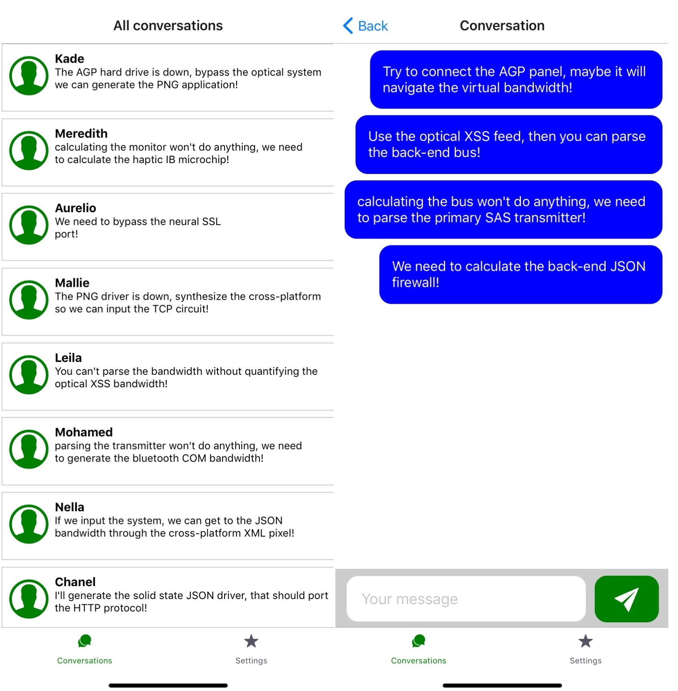

# Ch10. Creating a Real-Time Messaging Application with React Native and Expo

In this chapter, you'll create a real-time mobile messaging application using React Native and Expo that connects with a GraphQL server. 

By using WebSockets, you can create real-time connections with a server for web and mobile applications 

have a two-way data flow between your application and a GraphQL server. 

This connection can also be used for authentication by using OAuth and JWT tokens, 

The following topics will be covered in this chapter:

- GraphQL with React Native using Apollo
- Authentication flows in React Native
- GraphQL subscriptions

## Project overview

 we will create a mobile messaging application build with React Native and Expo that uses a GraphQL server for authentication and to send and receive messages. Messages can be received in real-time as GraphQL subscriptions are used through a WebSocket that was created with Apollo. Users need to be logged in to send messages through the application, for which an authentication flow was built using React Navigation and AsyncStorage to store authentication details in persistent storage.

## Getting started

 https://github.com/PacktPublishing/React-Projects/tree/ch10-initial. The complete source code can also be found on GitHub: https://github.com/PacktPublishing/React-Projects/tree/ch10[.](https://github.com/PacktPublishing/React-Projects/tree/ch9)

in the client and server directories in order to install all of the dependencies and start both the server and the application:

```
npm install && npm start
```


## Creating a real-time messaging application

### Setting up Apollo in React Native

To find your local IP address, for Mac:

```
# ipconfig getifaddr en0
192.168.0.13
```

 you can use this address to set up the Apollo client 

install several packages 

```
cd client && npm install graphql apollo-client apollo-link-http apollo-cache-inmemory react-apollo
```

 use apollo-client in `App.js`

```
import React from 'react';
import AppContainer from './AppContainer';
+ import { ApolloClient } from 'apollo-client';
+ import { InMemoryCache } from 'apollo-cache-inmemory';
+ import { HttpLink } from 'apollo-link-http';
+ import { ApolloProvider } from 'react-apollo';

+ const API_URL = 'http://192.168.1.107:4000/graphql';

+ const cache = new InMemoryCache();
+ const client = new ApolloClient({
+   link: new HttpLink({
+     uri: API_URL,
+   }),
+   cache
+ });

- const App = () => <AppContainer />;

+ const App = () => (
+  <ApolloProvider client={client}>
+     <AppContainer />
+  </ApolloProvider>
+ );

export default App;
```

### Using Apollo

the `client/Screens/Conversations.js`

```
import React from 'react';
import { FlatList, Text, View } from 'react-native';
import styled from 'styled-components/native';
+ import { Query } from 'react-apollo';
+ import { GET_CONVERSATIONS } from '../constants';
+ import ConversationItem from '../Components/Conversations/ConversationItem';
...
const Conversations = () => (
 ...
```

request the GET_CONVERSATIONS query 

```
const Conversations = () => (
  <ConversationsWrapper>
-   <ConversationsText>Loading...</ConversationsText>
+   <Query query={GET_CONVERSATIONS}>
+     {({ loading, data }) => {
+       if (loading) {
+         return <ConversationsText>Loading...</ConversationsText>
+       }

+       return (
+         <ConversationsList
+           data={data.conversations}
+           keyExtractor={item => item.userName}
+           renderItem={({ item }) => <ConversationItem item={item} /> }
+         />
+       );
+     }}
+   </Query>
  </ConversationsWrapper>
);

export default Conversations;
```

 passing navigator object to `ConversationItem`, 

```
...

- const Conversations = () => (
+ const Conversations = ({ navigation }) => (
  <ConversationsWrapper>
    <ConversationsText>Loading...</ConversationsText>
      <Query query={GET_CONVERSATIONS}>
        {({ loading, data }) => {
          if (loading) {
            return <ConversationsText>Loading...</ConversationsText>
          }

          return (
            <ConversationsList
              data={data.conversations}
              keyExtractor={item => item.userName}
-             renderItem={({ item }) => <ConversationItem item={item} /> }
+             renderItem={({ item }) => <ConversationItem item={item} navigation={navigation} />}
            />
          );
        }}
     </Query>
  </ConversationsWrapper>
);
```

 the `client/Components/Conversation/ConversationItem.js`

```
npm install react-native-vector-icons
```

The ConversationItem component can now navigate to the Conversationscreen when TouchableOpacity is being tapped:

```
import React from 'react';
import { Platform, Text, View, TouchableOpacity } from 'react-native';
import { Ionicons } from '@expo/vector-icons';
import styled from 'styled-components/native';

...

- const ConversationItem = ({ item }) => (
+ const ConversationItem = ({ item, navigation }) => (
-   <ConversationItemWrapper>
+   <ConversationItemWrapper
+     onPress={() => navigation.navigate('Conversation', { item })}
+   >
      <ThumbnailWrapper>
        ...
```

 the `client/Screens/Conversation.js` file, where the full conversation should be displayed. 

send another document to the GraphQL server that contains the query to retrieve the conversation.

```
import React from 'react';
import { Dimensions, ScrollView, Text, FlatList, View } from 'react-native';
+ import { Query } from 'react-apollo';
import styled from 'styled-components/native';
+ import Message from '../Components/Message/Message';
+ import { GET_CONVERSATION } from '../constants';

...

const Conversation = () => (
```

the query resolves the Querycomponent returns a data object with a field called messages.

```
...
const Conversation = ({ navigation }) => {
  const userName = navigation.getParam("userName", "");

  return (
    <ConversationWrapper>
        <Query query={GET_CONVERSATION} variables={{ userName }}>
                {({ loading, data }) => {
                   if (loading) {
                       return <ConversationBodyText>Loading...</ConversationBodyText>;
                   }
                   const { messages } = data.conversation;

                    return (
                        <ConversationBody>
                            <MessagesList
                                 data={messages}
                                 keyExtractor={item => String(item.id)}
                                 renderItem={({ item }) => (
                                   <Message align={item.userName === 'me' ? 'left' : 'right'}>
                                         {item.text}
                                   </Message>
                                 )}
                           />
                        </ConversationBody>
                    );
                }}
        </Query>
      <ConversationActions userName={userName} />
    </ConversationWrapper>
  );
};
...
export default Conversation;
```



## Authentication with React Navigation

 The flow for authenticating a user on a mobile application would be as follows:

1. The user opens your application
2. A loading screen is shown that checks for any authentication information in the persistent storage
3. If authenticated, the user will be forwarded to the main screen for the application; otherwise, they will be forwarded to the login screen, where the user can log in
4. Whenever the user signs out, the authentication details will be removed from the persistent storage

*the mobile device doesn't support local storage or session storage*,  *you'd need to use the `AsyncStorage` library from React Native to have persistent storage on both iOS and Android.* 

To set up the authentication flow we described earlier, you'll use the React Navigation package.

### Adding authentication

1. importing createSwitchNavigator into the `client/AppContainer.js` file

   ```
   import React from 'react';
   import { Platform } from 'react-native';
   import { Ionicons } from '@expo/vector-icons';
   import {
     createBottomTabNavigator,
     createStackNavigator,
   + createSwitchContainer,
     createAppContainer
   } from 'react-navigation';
   import { createStackNavigator } from 'react-navigation-stack';
   import { createBottomTabNavigator } from 'react-navigation-tabs';
   import Conversations from './Screens/Conversations';
   import Conversation from './Screens/Conversation';
   import Settings from './Screens/Settings';
   + import Login from './Screens/Login';
   ```

2. Instead of wrapping TabNavigator at the bottom of this file with createAppContainer, you need to return SwitchNavigator instead. 

   ```
   ...
   
   + const SwitchNavigator = createSwitchNavigator(
   +   {
   +     Main: TabNavigator,
   +     Auth: Login
   +   },
   +   {
   +     initialRouteName: 'Auth',
   +   }
   + );
   
   - export default createAppContainer(TabNavigator);
   + export default createAppContainer(SwitchNavigator);
   ```

3. to be connected to the GraphQL server first to receive the JWT token that is needed for authentication.

   the component for the Login screen already has a form, but submitting this form doesn't call any function to authenticate the user yet. in `Screens/Login.js`

   ```
   import React from 'react';
   import { View, TextInput } from 'react-native';
   import styled from 'styled-components/native';
   + import { Mutation } from 'react-apollo';
   import Button from '../Components/Button/Button';
   + import { LOGIN_USER } from '../constants';
   
   ...
   
   const Login = () => {
    const [userName, setUserName] = React.useState('');
    const [password, setPassword] = React.useState('');
   
    return (
   +  <Mutation mutation={LOGIN_USER}>
   +    {(loginUser, { loading }) => (
          <LoginWrapper>
             <StyledTextInput
               onChangeText={setUserName}
               value={userName}
               placeholder='Your username'
               textContentType='username'
             />
             <StyledTextInput
               onChangeText={setPassword}
               value={password}
               placeholder='Your password'
               textContentType='password'
             />
             <Button
   -						 title='Login'          	
   +            title={loading ? 'Loading...' : 'Login'}
   +           onPress={() => loginUser({ variables: { userName, password } })}
             />
           </LoginWrapper>
   +    )}
   +  </Mutation>
    );
   };
   
   export default Login;
   ```

4. To use the error variable to show an error message when the wrong credentials have been filled in

   ```
   import React from 'react';
   - import { View, TextInput } from 'react-native';
   + import { Alert, View, TextInput } from 'react-native';
   import styled from 'styled-components/native';
   import { Mutation } from 'react-apollo';
   import Button from '../Components/Button/Button';
   import { LOGIN_USER } from '../constants';
   
   ...
   
    <Button
      title={loading ? 'Loading...' : 'Login'}
      onPress={() => {
        loginUser({ variables: { userName, password } })
   +    .catch(error => {
   +        Alert.alert(
   +         'Error',
   +         error.graphQLErrors.map(({ message }) => message)[0]
   +        );
   +    });
      }}
    />
   
   ...
   ```

5. When the right username and password combination are used, the data variable should be used to store the JWT token that will be returned by the GraphQL server.

   ```
   import React from 'react';
   - import { Alert, View, TextInput } from 'react-native';
   + import { AsyncStorage, Alert, View, TextInput } from 'react-native';
   import styled from 'styled-components/native';
   import { Mutation } from 'react-apollo';
   import Button from '../Components/Button/Button';
   import { LOGIN_USER } from '../constants';
   
   ...
   
   const Login = ({ navigation }) => {
     ...
   
     <Button
       title={loading ? 'Loading...' : 'Login'}
       onPress={() => {
         loginUser({ variables: { userName, password } })
   +       .then(({data}) => {
   +         const { token } = data.loginUser;
   +         AsyncStorage.setItem('token', token);
   +       })
           .catch(error => {
             if (error) {
               Alert.alert(
                 'Error',
                 error.graphQLErrors.map(({ message }) => message)[0],
               );
             }
           });
         }}
       />
   
       ...
   ```

6. After storing the token, the user should be redirected to the main application

   ```
   ...
   
   - const Login = () => {
   + const Login = ({ navigation }) => {
     ...
   
   <Button
    title={loading ? 'Loading...' : 'Login'}
    onPress={() => {
    loginUser({ variables: { userName, password } })
     .then(({data}) => {
       const { token } = data.loginUser;
   -   AsyncStorage.setItem('token', token)
   +   AsyncStorage.setItem('token', token).then(value => {
   +     navigation.navigate('Main');
   +   });
     })
     .catch(error => {
       if (error) {
         Alert.alert(
           'Error',
           error.graphQLErrors.map(({ message }) => message)[0],
         );
       }
     });
    }}
   />
    
   ...
   ```

To check whether or not the user has logged in before, a third screen has to be added to SwitchNavigator. 

1. that is the `AuthLoading` screen to `AppContainer.js`,

   ```
   import React from 'react';
   import { Platform } from 'react-native';
   import { Ionicons } from '@expo/vector-icons';
   import {
     createSwitchNavigator,
     createAppContainer
   } from 'react-navigation';
   import { createStackNavigator } from 'react-navigation-stack';
   import { createBottomTabNavigator } from 'react-navigation-tabs';
   import Conversations from './Screens/Conversations';
   import Conversation from './Screens/Conversation';
   import Settings from './Screens/Settings';
   import Login from './Screens/Login';
   + import AuthLoading from './Screens/AuthLoading';
   
   const ConversationsStack = createStackNavigator({
   
     ...
   
   const SwitchNavigator = createSwitchNavigator(
     {
       Main: TabNavigator,
       Login,
   +   AuthLoading,
     },
     {
   -   initialRouteName: 'Login',
   +   initialRouteName: 'AuthLoading',
     }
   );
   
   export default createAppContainer(SwitchNavigator);
   ```

2. In this `AuthLoading` screen, the authentication token should be retrieved from the persistent storage, 

   ```
   import React from 'react';
   - import { Text, View } from 'react-native';
   + import { AsyncStorage, Text, View } from 'react-native';
   import styled from 'styled-components/native';
   
   ...
   
   - const AuthLoading = () => (
   + const AuthLoading = ({ navigation }) => {
   +   React.useEffect(() => {
   +     AsyncStorage.getItem('token').then(value => {
   +       navigation.navigate(value ? 'Main' : 'Auth');
   +     });
   +   }, [navigation]);
   
   +   return (
         <AuthLoadingWrapper>
           <AuthLoadingText>Loading...</AuthLoadingText>
         </AuthLoadingWrapper>
       );
   + };
   
   export default AuthLoading;
   ```

3. for a user to log out, in `client/Screens/Settings.js` 

   ```
   import React from 'react';
   - import { Text, View } from 'react-native';
   + import { AsyncStorage, Text, View } from 'react-native';
   import styled from 'styled-components/native';
   import Button from '../Components/Button/Button';
   
   ...
   
   - const Settings = () => (
   + const Settings = ({ navigation }) => (
         <SettingsWrapper>
   -       <Button title='Log out' />
   +       <Button
   +         title='Log out'
   +         onPress={() => {
   +           AsyncStorage.removeItem('token').then(() => navigation.navigate('AuthLoading'));
   +         }}
   +       />
         </SettingsWrapper>
     );
   
   export default Settings;
   ```

This can be requested by filling in a form on the Login screen. 

If the authentication is successful, the user will be redirected to the Main screen and, 

by using the Log out button on the Settingsscreen, the user can log out and will be directed back to the Login screen.

However, for the GraphQL server to know whether this user is authenticated, you need to send a validation token to it. In the next part of this section, you'll learn how to do this by using a **JSON Web Token**(**JWT**).

### Sending authentication details to the GraphQL server

1. Install Appollo package to support `context`

   ```
   npm install apollo-link-context
   ```

2. imported into the client/App.js file

   ```
   import React from 'react';
   import { ApolloClient } from 'apollo-client';
   import { InMemoryCache } from 'apollo-cache-inmemory';
   + import { setContext }  from 'apollo-link-context';
   import { HttpLink } from 'apollo-link-http';
   import { ApolloProvider } from 'react-apollo';
   import AppContainer from './AppContainer';
   
   const API_URL = '..';
   
   + const httpLink = new HttpLink({
   +   uri: API_URL,
   + });
   
   const cache = new InMemoryCache();
   
   const client = new ApolloClient({
   - link: new HttpLink({
   -   uri: API_URL,
   - }),
   + link: httpLink,
    cache,
   });
   
   const App = () => (
    ...
   ```

3. include the token

   ```
   import React from 'react';
   + import { AsyncStorage } from 'react-native';
   import AppContainer from './AppContainer';
   import { ApolloClient } from 'apollo-client';
   import { InMemoryCache } from 'apollo-cache-inmemory';
   import { setContext } from 'apollo-link-context';
   import { HttpLink } from 'apollo-link-http';
   import { ApolloProvider } from 'react-apollo';
   
   const API_URL = '...';
   
   const httpLink = new HttpLink({
     uri: API_URL,
   });
   
   + const authLink = setContext(async (_, { headers }) => {
   +   const token = await AsyncStorage.getItem('token');
   
   +   return {
   +     headers: {
   +       ...headers,
   +       authorization: token ? `Bearer ${token}` : '',
   +     }
   +   };
   + });
   
   ...
   
   const client = new ApolloClient({
   - link: httpLink,
   + link: authLink.concat(httpLink),
     cache
   });
    ...
   ```

Now, any document is passed to the GraphQL server will be able to use the token that was retrieved by using the login form of your application—something that you'll need when a mutation is used to send a message in the next section.

## Handling subscriptions in React Native with Apollo

For handling subscriptions, a WebSocket needs to be set up for your application, which enables a real-time two-way connection between the GraphQL server and your application.

### Setting up Apollo Client for GraphQL subscriptions

needs packages:

```
npm install apollo-link-ws subscriptions-transport-ws apollo-utilities
```

* The `apollo-link-ws` package helps you create a link to the GraphQL server running the subscription, like `apollo-link-http` does for queries and mutations. 
* `subscriptions-transport-ws` is a package that is needed to run apollo-link-ws 
* `apollo-utilities` is added to use a method that is available on those packages so that you can separate requests regarding subscriptions from requests for queries or mutations.

### to use subscriptions

1. Add the creation of the link to the GraphQL server using apollo-link-w, in `App.js`

   ```
   import React from 'react';
   import { AsyncStorage } from 'react-native';
   import { ApolloClient } from 'apollo-client';
   import { InMemoryCache } from 'apollo-cache-inmemory';
   import { setContext } from 'apollo-link-context';
   import { HttpLink } from 'apollo-link-http';
   + import { split } from 'apollo-link';
   import { ApolloProvider } from 'react-apollo';
   import AppContainer from './AppContainer';
   
   const API_URL = '...';
   + const SOCKET_URL = 'ws://192.168.1.107/graphql';
   
   ...
   
   + const wsLink = new WebSocketLink({
   +   uri: SOCKET_URL,
   +   options: {
   +     reconnect: true,
   +   },
   + });
   
   ...
   ```

2. Using the `split` and `getMainDefinition` methods, by separating `queries` and `mutations` from subscriptions.

   ```
   import React from 'react';
   import { AsyncStorage } from 'react-native';
   import { ApolloClient } from 'apollo-client';
   import { InMemoryCache } from 'apollo-cache-inmemory';
   import { setContext } from 'apollo-link-context';
   import { HttpLink } from 'apollo-link-http';
   import { split } from 'apollo-link';
   + import { WebSocketLink } from 'apollo-link-ws';
   + import { getMainDefinition } from 'apollo-utilities';
   import { ApolloProvider } from 'react-apollo';
   import AppContainer from './AppContainer';
   
   ...
   
   + const link = split(
   +   ({ query }) => {
   +     const definition = getMainDefinition(query);
   +
   +     return (
   +       definition.kind === 'OperationDefinition' && definition.operation === 'subscription'
   +     );
   +   },
   +   wsLink,
   +   httpLink,
   + );
   
   const cache = new InMemoryCache();
   
   const client = new ApolloClient({
   - link: authLink.concat(httpLink),
   + link: authLink.concat(link),
    cache,
   });
   
   const App = () => (
    ... 
   ```

The setup for Apollo now also supports subscriptions

### Adding subscriptions to React Native

Where the query will return the full conversation, 

the subscription will return any new message that may have been sent or received in that conversation.

the Querycomponent in client/Screens/Conversation.js, the Query component can be extended to also support subscriptions:

1. adding the subscriptions to the Conversation screen,  creating a new component `client/Components/Conversation/ConversationBody.js`

   ```
   import React from 'react';
   import styled from 'styled-components/native';
   import { Dimensions, ScrollView, FlatList } from 'react-native';
   import Message from '../Message/Message';
   
   const ConversationBodyWrapper = styled(ScrollView)`
     width: 100%;
     padding: 2%;
     display: flex;
     height: ${Dimensions.get('window').height * 0.6};
   `;
   
   const MessagesList = styled(FlatList)`
    width: 100%;
   `;
   
   const ConversationBody = ({ userName, messages }) => {
     return (
       <ConversationBodyWrapper>
         <MessagesList
           data={messages}
           keyExtractor={item => String(item.id)}
           renderItem={({ item }) => (
             <Message align={item.userName === 'me' ? 'left' : 'right'}>
               {item.text}
             </Message>
           )}
         />
       </ConversationBodyWrapper>
     );
   };
   
   export default ConversationBody;
   ```

2. Import to  `client/Screens/Conversation.js`

   ```
   import React from 'react';
   - import { Dimensions, ScrollView, Text, FlatList, View } from 'react-native';
   + import { Text, View } from 'react-native';
   import { Query } from 'react-apollo';
   import styled from 'styled-components/native';
   - import Message from '../Components/Message/Message';
   + import ConversationBody from '../Components/Conversation/ConversationBody';
   import { GET_CONVERSATION } from '../constants';
   
   ...
   
   const Conversation = ({ navigation }) => {
     const userName = navigation.getParam('userName', '');
   
     return (
       <ConversationWrapper>
         <Query query={GET_CONVERSATION} variables={{ userName }}>
   -       <ConversationBody>
             {({ loading, data }) => {
               if (loading) {
                 return <ConversationBodyText>Loading...</ConversationBodyText>;
               }
               const { messages } = data.conversation;
   
   -           return (
   -             <MessagesList
   -               data={messages}
   -               keyExtractor={item => String(item.id)}
   -               renderItem={({ item }) => (
   -                 <Message align={item.userName === 'me' ? 'left' : 'right'}>
   -                   {item.text}
   -                 </Message>
   -               )}
   -             />
   -           );
   -         }}
   
   +         return <ConversationBody messages={messages} userName={userName} />
           }}
   -     </ConversationBody>
       </Query>
       <ConversationActions userName={userName} />
    </ConversationWrapper>
    );
   };
   
   export default Conversation;
   ```

3.  the logic for retrieving the subscription

   ```
   ...
     
     return (
       <ConversationWrapper>
         <Query query={GET_CONVERSATION} variables={{ userName }}>
   -       {({ loading, data }) => {
   +       {({ subscribeToMore, loading, data }) => {
             if (loading) {
               return <ConversationBodyText>Loading...</ConversationBodyText>;
             }
             const { messages } = data.conversation;
   
   -         return <ConversationBody messages={messages} userName={userName} />
   +         return (
   +           <ConversationBody
   +             messages={messages}
   +             userName={userName}
   +             subscribeToMore={subscribeToMore}
   +           />
            }}
          </Query>
          <ConversationActions userName={userName} />
       </ConversationWrapper>
     );
   };
   ```

4. In the ConversationBody component, the subscribeToMore method can now be used to retrieve any new messages that are added to the conversation

   ```
   import { Dimensions, ScrollView, FlatList } from 'react-native';
   import Message from '../Message/Message';
   + import { MESSAGE_ADDED } from '../../constants';
   
   ...
   
   - const ConversationBody = ({ userName, messages }) => {
   + const ConversationBody = ({ subscribeToMore, userName, messages }) => {
       return (
         <ConversationBodyWrapper
   ```

5. the logic for retrieving the subscription can be added.

   ```
   ...
   const ConversationBody = ({ subscribeToMore, userName, messages }) => {
   +  React.useEffect(() => {
   +    subscribeToMore({
   +      document: MESSAGE_ADDED,
   +      variables: { userName },
   +      updateQuery: (previous, { subscriptionData }) => {
   +        if (!subscriptionData.data) {
   +          return previous;
   +        }
   +        const messageAdded = subscriptionData.data.messageAdded;
   +
   +        return Object.assign({}, previous, {
   +          conversation: {
   +            ...previous.conversation,
   +            messages: [...previous.conversation.messages, messageAdded]
   +          }
   +        });
   +     }
   +   });
   + }, []);
   
     return (
       <ConversationBodyWrapper>
   ```

### Using mutations with subscriptions

the new React Apollo Hooks will be used.

*The React Apollo Hooks can be used from the* `react-apollo` *package, but if you only want to use the Hooks, you can install* `@apollo/react-hooks` *instead by executing* *`npm install @apollo/react-hooks`. The GraphQL components such as Query or Mutation are available in both the react-apollo and* *@apollo/react-componentspackages. Using these packages will decrease the size of your bundle as you're only importing the features you need.*

1. The `useMutation` Hook should be imported into the `client/Components/Conversation/ConversationActions.js`

   ```
   import React from 'react';
   import { Platform, Text, View } from 'react-native';
   import styled from 'styled-components/native';
   import { Ionicons } from '@expo/vector-icons';
   + import { useMutation } from 'react-apollo';
   import TextInput from '../TextInput/TextInput';
   import Button from '../Button/Button';
   + import { SEND_MESSAGE } from '../../constants';
   
   ...
   
   const ConversationActions = ({ userName }) => {
     ...
   ```

2. `useMutation` hook

   ```
   ...
   const ConversationActions = ({ userName }) => {
   + const [sendMessage] = useMutation(SEND_MESSAGE); 
     const [message, setMessage] = React.useState('');
     
   
     return (
       <ConversationActionsWrapper>
   +     <>
           <TextInput
             width={75}
             marginBottom={0}
             onChangeText={setMessage}
             placeholder='Your message'
             value={message}
           />
           <Button
             width={20}
             padding={10}
   +         onPress={() => {
   +           sendMessage({ variables: { to: userName, text: message } });
   +           setMessage('');
   +         }}
             title={
               <Ionicons
                 name={`${Platform.OS === 'ios' ? 'ios' : 'md'}-send`}
                 size={42}
                 color='white'
               />
             }
           />
   +     </>
   +   </ConversationActionsWrapper>
     );
   };
   ```

3. add `KeyboardAvoidingView`

   ```
   import React from 'react';
   - import { Platform, Text, View } from 'react-native';
   + import { Platform, Text, KeyboardAvoidingView } from 'react-native';
   import styled from 'styled-components/native';
   import { Ionicons } from '@expo/vector-icons';
   import { useMutation } from 'react-apollo';
   import TextInput from '../TextInput/TextInput';
   import Button from '../Button/Button';
   import { SEND_MESSAGE } from '../../constants';
   
   - const ConversationActionsWrapper = styled(View)`
   + const ConversationActionsWrapper = styled(KeyboardAvoidingView)`
       width: 100%;
       background-color: #ccc;
       padding: 2%;
       display: flex;
       flex-direction: row;
       align-items: center;
       justify-content: space-around;
   `;
   
   const ConversationActions = ({ userName }) => {
   
    ...
   ```

4. customized `KeyboardAvoidingView`

   ```
   ...
   
   const ConversationActions = ({ userName }) => {
     const [sendMessage] = useMutation(SEND_MESSAGE);
     const [message, setMessage] = React.useState('');
     
     return (
   -   <ConversationActionsWrapper
   +   <ConversationActionsWrapper
   +     keyboardVerticalOffset={Platform.OS === 'ios' ? 190 : 140}
   +     behavior=;padding'
   +   >
         <Mutation mutation={SEND_MESSAGE}>
           ... 
   ```

# Further reading

For more information about what was covered in this chapter, check out the following resources:

- WebSockets: https://developer.mozilla.org/en-US/docs/Web/API/WebSocket
- Apollo React Hooks: https://www.apollographql.com/docs/react/api/react-hooks/

# Q&A

#### Question

When using RNGH 1.4.1 with RN 0.60 the following warning appears:

```
Accessing view manager configs directly off UIManager via UIManager['getConstants'] is no longer supported. Use UIManager.getViewManagerConfig('getConstants') instead.
```

The stack trace points at `createHandler.js:39`

#### Answer:

​	just downgrade `react-native-gesture-handler` to `1.3.0`.