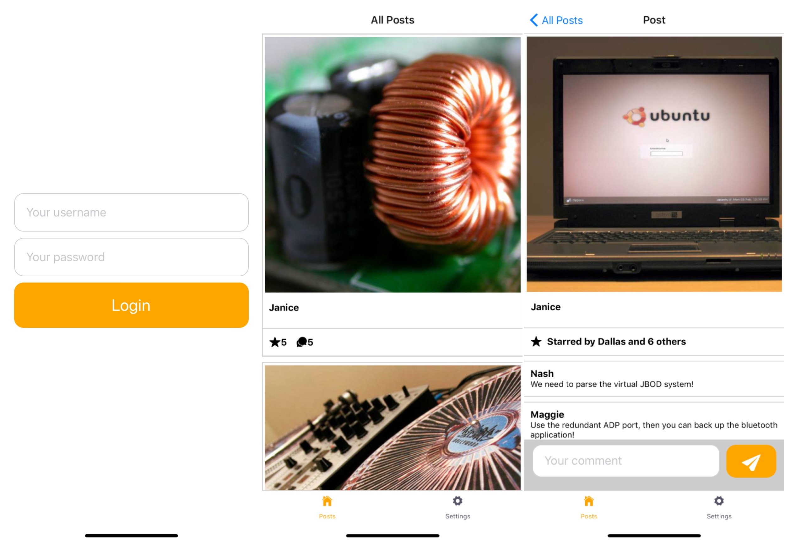
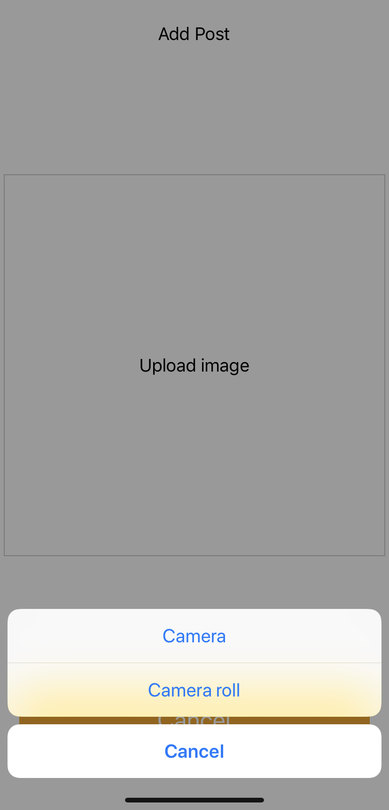
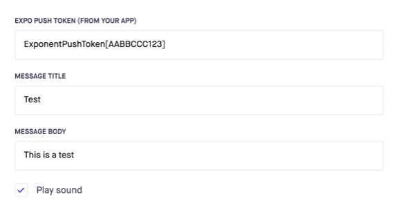
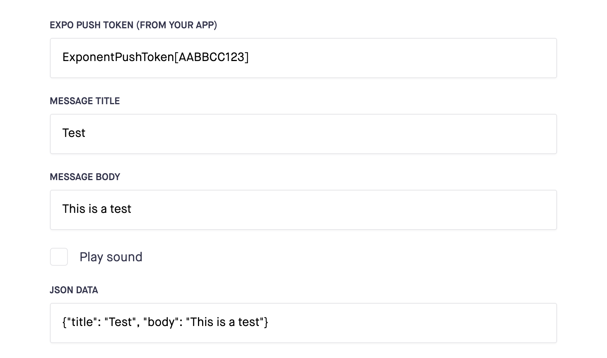

# CH11. Build a Full Stack Social Media Application with React Native and GraphQL

*  can send direct notifications to the people that have your application installed
*  can target users when there's an important event taking place in your application or when someone hasn't used the application for a while. 
* can directly use the camera of the device it's running on to take photos and videos.

The following topics will be covered in this chapter:

- Using the camera with React Native and Expo
- Refreshing data with React Native and GraphQL
- Sending mobile notifications with Expo

## Getting started

The project that we'll create in this chapter builds upon an initial version that you can find on GitHub: https://github.com/PacktPublishing/React-Projects/tree/ch11-initial. The complete source code can also be found on GitHub: https://github.com/PacktPublishing/React-Projects/tree/ch11.

The local IP address must be used to create the value for API_URL in the file `client/App.js`, 

```
...

- const API_URL = '';
+ const API_URL = 'http://192.168.1.107/graphql';

const httpLink = new HttpLink({
  uri: API_URL,
});
const authLink = setContext(async (_, { headers }) => {

  ...
```



## Code structure

### Entry point

App -> AppContainer

* SwitchNavigator
  * TabNavigator
    * PostsStack
      * Posts (screen)
      * Post (screen)
    * NotificationsStack
      * Notifications (screen)
    * Settings (screen)
  * Login (screen)
  * AuthLoading (defaut screen)
  * AddPost (screen)

### Screens ( Components )

1. AddPost
   * Button
2. Authloading
3. Login 
   * Button
   * TextInput
4. Post
   * PostContent
   * Comment
5. Posts
   * PostItem
6. Settings
   * Button

## Using the camera

### using photos

To add the feature to create new posts to your social media application,

1. add GraphQL mutation, in `constants.js`

   ```
   export const GET_POSTS = gql`
     ...
   `;
   
   + export const ADD_POST = gql`
   +   mutation addPost($image: String!) {
   +     addPost(image: $image) {
   +       image
   +     }
   +   }
   + `;
   ```

2. added to `SwitchNavigation` the `client/AppContainer.js` 

   ```
   ...
   import Login from './Screens/Login';
   import AuthLoading from './Screens/AuthLoading';
   + import AddPost from './Screens/AddPost';
     
     ...
   
   const SwitchNavigator = createSwitchNavigator(
     {
       Main: TabNavigator,
       Login,
       AuthLoading,
   +   AddPost,
     },
     {
   +   mode: 'modal',
       initialRouteName: 'AuthLoading',
     },
   );
   
   export default createAppContainer(SwitchNavigator);
   ```

3.  to open this modal, This link can be added by setting `navigationOptions` in the `client/Screens/Posts.js` 

   ```
   - import { FlatList, Text, View } from "react-native";
   + import { Button, FlatList, Text, View } from "react-native";
   
   
   ...
   
   + Posts.navigationOptions = ({ navigation}) => ({
   +   headerRight: (
   +     <Button onPress={() => navigation.navigate('AddPost')} title='Add Post' />
   +   ),
   + });
   
   export default Posts;
   ```

 To add ImagePicker to the AddPost screen, to enable the selection of photos from the camera roll in the `client/Screens/AddPost.js` file:

1. the right permission should be set

   ```
   expo install expo-permissions
   ```

2.  import the permissions API and create the function

   ```
   import React from 'react';
   import styled from 'styled-components/native';
   import Button from '../Components/Button/Button';
   + import * as Permissions from 'expo-permissions';
   
   ...
   
   const AddPost = ({ navigation }) => {
   +  const getPermissionAsync = async () => {
   +    if (Platform.OS === 'ios') {
   +      const { status } = await Permissions.askAsync(Permissions.CAMERA_ROLL);
   +
   +      if (status !== 'granted') {
   +        alert('Sorry, you need camera roll permissions! Go to 'Settings > Expo' to enable these.');
   +      }
   +    }
   + };
   
     ...
   ```

3. Add `UploadImage` component

   ```
   - import { Dimensions, Text, View } from 'react-native';
   + import { Dimensions, Platform, TouchableOpacity, Text, View } from 'react-native';
   
   ...
    return (
       <AddPostWrapper>
         <AddPostText>Add Post</AddPostText>
   
   +     <UploadImage onPress={() => getPermissionAsync()}>
   +       <AddPostText>Upload image</AddPostText>
   +     </UploadImage>
    
         <Button onPress={() => navigation.navigate('Main')} title='Cancel' />
       </AddPostWrapper>
     );
   ...
   
   + const UploadImage = styled(TouchableOpacity)`
   + width: ${Dimensions.get("window").width * 0.98};
   + height: ${Dimensions.get("window").width * 0.98};
   + margin: ${Dimensions.get("window").width * 0.01}px;
   + border: 1px solid #ccc;
   + display: flex;
   + align-items: center;
   + justify-content: center;
   + `;
   export default AddPost;
   ```

   When tapped, a popup requesting permission to access the camera roll will be opened on iOS devices.

4. call the ImagePicker API from Expo to open the camera roll.

   ```
   expo install expo-image-picker
   ```

   ddd

   ```
   import React from 'react';
   import { Dimensions, Platform, TouchableOpacity, Image, Text, View } from 'react-native';
   import styled from 'styled-components/native';
   import Button from '../Components/Button/Button';
   + import * as ImagePicker from 'expo-image-picker';
   import * as Permissions from 'expo-permissions';
   
   ...
   
   const AddPost = ({ navigation }) => {
   +  const [imageUrl, setImageUrl] = React.useState(false);
   
   +  const pickImageAsync = async () => {
   +    const result = await ImagePicker.launchImageLibraryAsync({
   +      mediaTypes: ImagePicker.MediaTypeOptions.All,
   +      allowsEditing: true,
   +      aspect: [4, 4],
   +    });
   +    if (!result.cancelled) {
   +      setImageUrl(result.uri);
   +    }
   +  };
   
      return (
        ...
   ```

   

   ```
   ...
   
   const AddPost = ({ navigation }) => {
     ...
   
     const getPermissionAsync = async () => {
       if (Platform.OS === 'ios') {
         const { status } = await Permissions.askAsync(Permissions.CAMERA_ROLL);
   
         if (status !== 'granted') {
           alert('Sorry, you need camera roll permissions! Go to 'Settings > Expo' to enable these.');
   +     } else {
   +       pickImageAsync();
         }
       }
     };
   
     return (
   ```

5. the URL to the image is now stored in the local state 

   ```
   ...
    
     return (
       <AddPostWrapper>
         <AddPostText>Add Post</AddPostText>
   
         <UploadImage onPress={() => getPermissionAsync()}>
   +       {imageUrl ? (
   +         <Image
   +           source={{ uri: imageUrl }}
   +           style={{ width: '100%', height: '100%' }}
   +         />
   +       ) : (
             <AddPostText>Upload image</AddPostText>
   +       )}
         </UploadImage>
    
         <Button onPress={() => navigation.navigate('Main')} title='Cancel' />
       </AddPostWrapper>
     );
   };
   
   ...
   ```

### using camera

1. grant your application permission to access the camera roll

   ```
   ...
   
     const getPermissionAsync = async () => {
     if (Platform.OS === 'ios') {
   -   const { status } = await Permissions.askAsync(Permissions.CAMERA_ROLL);
   -   if (status !== 'granted') {
   +     const { status: statusCamera } = await Permissions.askAsync(Permissions.CAMERA);
   +     const { status: statusCameraRoll } = await Permissions.askAsync(Permissions.CAMERA_ROLL);
   
   +     if (statusCamera !== 'granted' || statusCameraRoll !== 'granted') {
           alert(
             `Sorry, you need camera roll permissions! Go to 'Settings > Expo' to enable these.`
           );
         } else {
           await pickImageAsync();
         }
       }
     };
   
     return (
       ...
   ```

2.  to launch the camera

   ```
   const AddPost = ({ navigation }) => {
     const [imageUrl, setImageUrl] = React.useState(false);
     
   -  const pickImageAsync = async () => {
   +  const addImageAsync = async (camera = false) => {
   -    const result = await ImagePicker.launchCameraAsync({
   -      mediaTypes: ImagePicker.MediaTypeOptions.All,
   -      allowsEditing: true,
   -      aspect: [4, 4]
   -    });
   
   +    const result = !camera 
   +      ? await ImagePicker.launchImageLibraryAsync({
   +          mediaTypes: ImagePicker.MediaTypeOptions.All,
   +          allowsEditing: true,
   +          aspect: [4, 4]
   +        })
   +      : await ImagePicker.launchCameraAsync({
   +          allowsEditing: true,
   +          aspect: [4, 4]
   +        })
        if (!result.cancelled) {
          setImageUrl(result.uri);
        }
      };
   ```

3. a selection must be made between using the camera or the camera roll 

   ```
   npm install @expo/react-native-action-sheet
   ```

   wrap it in your top-level component in the `client/App.js`

   ```
   import React from 'react';
   import { AsyncStorage } from 'react-native';
   import { ApolloClient } from 'apollo-client';
   import { InMemoryCache } from 'apollo-cache-inmemory';
   import { setContext } from 'apollo-link-context';
   import { HttpLink } from 'apollo-link-http';
   import { ApolloProvider } from '@apollo/react-hooks';
   + import { ActionSheetProvider } from '@expo/react-native-action-sheet';
   import AppContainer from './AppContainer';
   
   ...
   
   const App = () => (
     <ApolloProvider client={client}>
   +   <ActionSheetProvider>
         <AppContainer />
   +   </ActionSheetProvider>
     </ApolloProvider>
   );
   
   export default App;
   ```

   And create `ActionSheet` in `client/Screens/AddPost.js`:

   ```
   ...
   import * as ImagePicker from 'expo-image-picker';
   import * as Permissions from 'expo-permissions';
   + import { connectActionSheet } from '@expo/react-native-action-sheet';
   import Button from '../Components/Button/Button';
   
   ...
   
   - const AddPost = ({ navigation }) => {
   + const AddPost = ({ navigation, showActionSheetWithOptions }) => {
       
       ...
   
   - export default AddPost;
   + const ConnectedApp = connectActionSheet(AddPost);
   + export default ConnectedApp;
   ```

4. a function to open this ActionSheet must be added, 

   ```
   ...
   
   +  const openActionSheet = () => {
   +    const options = ['Camera', 'Camera roll', 'Cancel'];
   +    const cancelButtonIndex = 2;
   +    
   +    showActionSheetWithOptions(
   +      {
   +        options,
   +        cancelButtonIndex
   +      },
   +      buttonIndex => {
   +        if (buttonIndex === 0 || buttonIndex === 1) {
   +          addImageAsync(buttonIndex === 0);
   +        }
   +      },
   +    );
   +   };
   
     const getPermissionAsync = async () => {
     ....
      if (statusCamera !== 'granted' || statusCameraRoll !== 'granted') {
           alert(
             `Sorry, you need camera roll permissions! Go to 'Settings > Expo' to enable these.`
           );
         } else {
   -       pickImageAsync();
   +       openActionSheet();
         }
       }
     };
   
     return (
       ...
   ```



​	Tapping the image placeholder will give the user the option to either use Camera or Camera roll 

5. sent the image to the server, in the `client/Screens/AddPost.js`

   ```
   import * as Permissions from 'expo-permissions';
   import { connectActionSheet } from '@expo/react-native-action-sheet';
   + import { useMutation } from '@apollo/react-hooks';
   + import { ADD_POST } from '../constants';
   import Button from '../Components/Button/Button';
   
   ...
   
   const AddPost = ({ navigation, showActionSheetWithOptions }) => {
   + const [addPost] = useMutation(ADD_POST);
     const [imageUrl, setImageUrl] = React.useState(false);
   
     ...
   
     return (
       <AddPostWrapper>
         <AddPostText>Add Post</AddPostText>
           <UploadImage onPress={() => getPermissionAsync()}>
             {imageUrl ? (
               <Image
                 source={{ uri: imageUrl }}
                 style={{ width: '100%', height: '100%' }}
               />
             ) : (
               <AddPostText>Upload image</AddPostText>
             )}
           </UploadImage>
   
   +       {imageUrl && (
   +         <Button
   +           onPress={() => {
   +             addPost({ variables: { image: imageUrl } }).then(() => 
   +               navigation.navigate('Main')
   +             );
   +           }}
   +           title='Submit'
   +         />
   +       )}
          <Button onPress={() => navigation.navigate('Main')} title='Cancel' />
        </AddPostWrapper>
      );
    };
   
   export default AddPost;
   ```

6.  reloaded and the post you've just added will be displayed in this list.

   ```
   import { connectActionSheet } from '@expo/react-native-action-sheet';
   import { useMutation } from '@apollo/react-hooks';
   - import { ADD_POST } from '../constants';
   + import { ADD_POST, GET_POSTS } from '../constants';
   import Button from '../Components/Button/Button';
   
   ...
   
   const AddPost = ({ navigation, showActionSheetWithOptions }) => {
   - const [addPost] = useMutation(ADD_POST);
   + const [addPost] = useMutation(ADD_POST, {
   +   refetchQueries: [{ query: GET_POSTS }]
   + });
     const [imageUrl, setImageUrl] = React.useState(false);
   
    ...
   
    return (
      <AddPostWrapper>
      ...
   ```

7. update server

   typeDefs.js

   ```
   type Post {
       id: Int!
       userName: String!
       image: String!
      - text: String!
       totalStars: Float!
       totalComments: Float!
       stars: [Star]
     
     ...
     
     type Mutation {
     -  addPost(image: String!, text: String!): Post
     +  addPost(image: String!): Post
       loginUser(userName: String!, password: String!): 
   ```

   resolvers.js

   ```
   const mockPost = ({ userName = false, image = false, text = false }) => {
   const mockPost = ({ userName = false, image = false }) => {
     const totalStars = Math.floor(Math.random() * 50) + 1;
     const totalComments = Math.floor(Math.random() * 5) + 1;
     return {
       id: faker.random.number,
       userName: userName || faker.name.firstName,
       image: image || faker.image.technics(600, 600),
       - text: text || faker.hacker.phrase,
       totalStars,
   
   ...
   
    Mutation: {
       - addPost: (_, { image, text = "" }, { token }) => {
       + addPost: (_, { image }, { token }) => {
         const isValid = token ? isTokenValid(token) : false;
         
         if (isValid) {
   				const resolvers = {
             image,
             totalComments: 0,
             totalStars: 0,
           -  text,
             stars,
             comments
           };
   ```

## Retrieving near real-time data using GraphQL

using pooling

Next to setting a pollInterval variable on the useQuery Hook, you can also manually call the refetch function 

1.  disables the polling for now.

   ```
   ...
   
   const Posts = ({ navigation }) => {
   - const { loading, data } = useQuery(GET_POSTS, { pollInterval: 2000 });
   + const { loading, data, refetch } = useQuery(GET_POSTS, { pollInterval: 0 });
     return (
       <PostsWrapper>
         {loading ? (
           <PostsText>Loading...</PostsText>;
         ) : (
             ...
   ```

2.  pull-to-refresh interaction

   ```
   import React from 'react';
   - import { Query } from "react-apollo";
   + import { useQuery } from '@apollo/react-hooks';
   - import { Button, FlatList, Text, View } from 'react-native';
   + import { Button, FlatList, Text, View, ScrollView, RefreshControl } from 'react-native';
   import styled from 'styled-components/native';
   ```

3. This ScrollView component should be wrapped around the PostsList component,

   ```
   const Posts = ({ navigation }) => {
     const { loading, data, refetch } = useQuery(GET_POSTS, { pollInterval: 0 });
     return (
       <PostsWrapper>
         {loading ? (
           <PostsText>Loading...</PostsText>;
         ) : (
   +       <ScrollView
   +         style={{ width: '100%' }}
   +         refreshControl={
   +           <RefreshControl />
   +         }
   +       >
            <PostsList
              data={data.posts}
              keyExtractor={item => String(item.id)}
              renderItem={({ item }) => (
                <PostItem item={item} navigation={navigation} />
              )}
            />
   +       </ScrollView>
         )}
       </PostsWrapper>
     );
   };
   ```

   If you now pull down the Posts screen, a loading indicator will be displayed at the top of the screen that keeps spinning

4. refresh the data

   ```
   ...
   const Posts = ({ navigation }) => {
     const { loading, data, refetch } = useQuery(GET_POSTS, { pollInterval: 0 });
   + const [refreshing, setRefreshing] = React.useState(false);
   
   + const handleRefresh = (refetch) => {
   +   setRefreshing(true);
   +
   +   refetch().then(() => setRefreshing(false));
   + }
   
     return(
       <PostsWrapper>
       {loading ? (
         <PostsText>Loading...</PostsText>;
       ) : (
         <ScrollView
           style={{ width: '100%' }}
           refreshControl={
   -         <RefreshControl />
   +         <RefreshControl
   +           refreshing={refreshing}
   +           onRefresh={() => handleRefresh(refetch)}
   +         />
           }
         >
           <PostsList
             ...
   ```

5. sfsd

   ```
   const Posts = ({ navigation }) => {
     const { loading, data, refetch } = useQuery(GET_POSTS, { pollInterval: 0 });
     const [refreshing, setRefreshing] = React.useState(false);
   
     const handleRefresh = (refetch) => {
       setRefreshing(true);
    
       refetch().then(() => setRefreshing(false));
     }
   
     return(
       <PostsWrapper>
   -     {loading ? (
   +     {loading && !refreshing ? (
           <PostsText>Loading...</PostsText> 
         ) : (
         
           ...
   ```

making it possible for your users to retrieve the latest data by pulling down the screen.

## Sending notifications with Expo

Retrieving the push code 

1. permit your application to push these notifications. To ask for this permission, new file called `registerForPushNotificationsAsync.js`. This file must be created in the new `client/utils` directory, 

   ```
   import { Notifications } from 'expo';
   import * as Permissions from 'expo-permissions';
   
   async function registerForPushNotificationsAsync() {
     const { status: existingStatus } = await Permissions.getAsync(
       Permissions.NOTIFICATIONS
     );
     let finalStatus = existingStatus;
    
     if (existingStatus !== 'granted') {
       const { status } = await Permissions.askAsync(Permissions.NOTIFICATIONS);
       finalStatus = status;
     }
   
     if (finalStatus !== 'granted') {
       return;
     }
   
     const token = await Notifications.getExpoPushTokenAsync();
     return token;
   }
   
   export default registerForPushNotificationsAsync;
   ```

2. this is done in the `client/Screens/Posts.js` file by using an `useEffect` Hook:

   ```
   import { GET_POSTS } from '../constants';
   import PostItem from '../Components/Post/PostItem';
   + import registerForPushNotificationsAsync from '../utils/registerForPushNotificationsAsync';
   
   ...
   
   const Posts = ({ navigation }) => {
     const { loading, data, refetch } = useQuery(GET_POSTS, { pollInterval: 0 });
     const [refreshing, setRefreshing] = React.useState(false);
   
   + React.useEffect(() => {
   +   registerForPushNotificationsAsync();
   + });
   
   ...
   ```

   3. Send the message,
   
      https://expo.io/dashboard/notifications 
   
      https://docs.expo.io/versions/latest/guides/push-notifications/
   
      ExponentPushToken[]
   
   

### Handling foreground notifications

1. The setup for Apollo Client in `client/App.js` should be extended in a way that you could query for notifications and can add new notifications when these are spotted by the listener.

   ```
   ...
   
    const client = new ApolloClient({
      link: authLink.concat(link),
      cache,
   +  typeDefs: `
   +    type Notification {
   +      id: Number!
   +      title: String!
   +      body: String!
   +    }
   +    extend type Query {
   +      notifications: [Notification]!
   +    }
   +  `
    });
   
   + cache.writeData({
   +  data: {
   +    notifications: []
   +  }
   + });
   
   const App = () => {
     
     ...
   ```

2. in the `client/constants.js`

   ```
   ...
   
   export const ADD_POST = gql`
     mutation addPost($image: String!) {
       addPost(image: $image) {
         image
       }
     }
   `;
   
   + export const GET_NOTIFICATIONS = gql`
   +   query getNotifications {
   +     notifications {
   +       id @client
   +       title @client
   +       body @client
   +     }
   +   }
   + `;
   ```

3. to display the notifications for the user.

4. in `client/AppContainer.js`

   ```
   import React from 'react';
   import { Platform } from 'react-native';
   import { Ionicons } from '@expo/vector-icons';
   import {
     createSwitchNavigator,
     createAppContainer
   } from 'react-navigation';
   import { createStackNavigator } from 'react-navigation-stack';
   import { createBottomTabNavigator } from 'react-navigation-tabs';
   import Posts from './Screens/Posts';
   import Post from './Screens/Post';
   import Settings from './Screens/Settings';
   import Login from './Screens/Login';
   import AuthLoading from './Screens/AuthLoading';
   import AddPost from './Screens/AddPost';
   + import Notifications from './Screens/Notifications';
   
   ...
   
   + const NotificationsStack = createStackNavigator({
   +   Notifications: {
   +     screen: Notifications,
   +     navigationOptions: { title: 'Notifications' },
   +   }
   + });
   ```

   After StackNavigator for the Notifications screen is created, it needs to be added to TabNavigator so it will be displayed next to the Posts and Settings screens:

   ```
   ...
   
   const TabNavigator = createBottomTabNavigator(
     {
       Posts: PostsStack,
   +   Notifications: NotificationsStack,
       Settings
     },
     {
       initialRouteName: 'Posts',
       defaultNavigationOptions: ({ navigation }) => ({
       tabBarIcon: ({ tintColor }) => {
         const { routeName } = navigation.state;
         let iconName;
        
         if (routeName === 'Posts') {
           iconName = `${Platform.OS === 'ios' ? 'ios' : 'md'}-home`;
         } else if (routeName === 'Settings') {
           iconName = `${Platform.OS === 'ios' ? 'ios' : 'md'}-settings`;
   +     } else if (routeName === 'Notifications') {
   +       iconName = `${Platform.OS === 'ios' ? 'ios' : 'md'}-notifications`;
   +     }
   
         return <Ionicons name={iconName} size={20} color={tintColor} />;
     },
   
     ...
   ```

5. This mutation must be added to the `client/constants.js`

   ```
   ...
   
   export const GET_NOTIFICATIONS = gql`
     query getNotifications {
       notifications {
         id @client
         title @client
         body @client
       }
     }
   `;
   
   + export const ADD_NOTIFICATION = gql`
   +   mutation {
   +     addNotification(id: $id, title: $title, body: $body) @client
   +   }
   + `;
   ```

6.  Add the listener from the `Notifications API` to the `client/App.js`

   ```
   ...
   
   import { ActionSheetProvider } from '@expo/react-native-action-sheet';
   + import { Notifications } from 'expo';
   import AppContainer from './AppContainer';
   - import { GET_NOTIFICATIONS } from './constants';
   + import { ADD_NOTIFICATIONS, GET_NOTIFICATIONS } from './constants';
   
   ...
   
   const App = () => {
   + React.useEffect(() => {
   +   Notifications.addListener(handleNotification);
   + });
   
   + const handleNotification = ({ data }) => {
   +   client.mutate({
   +     mutation: ADD_NOTIFICATION,
   +     variables: {
   +       id: Math.floor(Math.random() * 500) + 1,
   +       title: data.title,
   +       body: data.body,
   +     },
   +   });
   + };
   
     return (
   
       ...
   ```

7. sending the notification from https://expo.io/dashboard/notifications. A test notification can be sent by adding the body in the form:

   

```
# mus login first in the server machine
expo login
```


ExponentPushToken[kz2g44H8GU2jth-s-CyoEh]


## localtunnel

```
npx localtunnel --port 8000
```