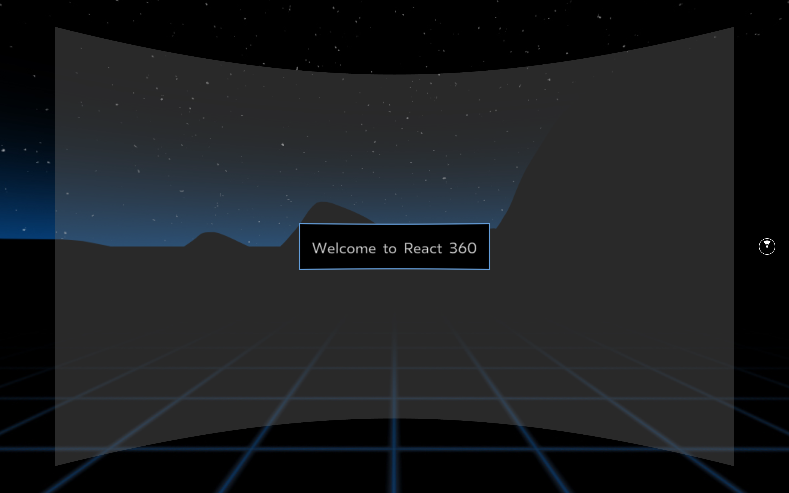

# CH12. Creating a Virtual Reality Application with React 360

The following topics will be covered in this chapter:

- Getting started with React 360
- Creating a panorama viewer with React 360
- Building clickable elements

In this chapter, you will build a VR application with React 360 that uses principles from both React and React Native. Both 2D panorama images and 3D objects will be added to this application and the project can be run in the browser using the **Metro bundler**.

## Getting started

The application for this chapter will be built from scratch and uses assets that can be found on GitHub at https://github.com/PacktPublishing/React-Projects/tree/ch12-assets[.](https://github.com/PacktPublishing/React-Projects/tree/ch1-assets) These assets should be downloaded to your computer so that you can use them later on in this chapter. The complete code for this chapter can be found on GitHub at https://github.com/PacktPublishing/React-Projects/tree/ch12.

- For Node.js (should be v10.16.3 or higher), use the following command:

```
node -v
```

- For npm (should be v6.9.0 or higher), use the following command:

```
npm -v
```

## Code structure

```
.
├── README.md
├── assets
│   ├── ch1201.png
│   └── ch1202.png
└── virtual-reality
    ├── Components
    │   ├── Helicopter.js
    │   ├── Navigation.js
    │   └── Panel.js
    ├── __tests__
    │   └── index-test.js
    ├── client.js
    ├── index.html
    ├── index.js
    ├── package.json
    ├── rn-cli.config.js
    ├── static_assets
    │   ├── 360_world.jpg
    │   ├── beach.jpg
    │   ├── helicopter.obj
    │   ├── landscape.jpg
    │   ├── mountain.jpg
    │   └── winter.jpg
    └── yarn.lock

```

# Creating a VR application with React 360

## Setting up React 360

Install The React 360 CLI

```
npm install -g react-360-cli
```

to create your first React 360 project

```
react-360 init virtual-reality

Done!
  Now enter the new project directory by running `cd virtual-reality`
  Run `npm start` to initialize the development server
  From there, browse to http://localhost:8081/index.html
  Open `Panel.js` to begin editing your app.
```

Installed packages:

`react`,` react-native`,` react-360`,` react-360-web`, and `three`. 

The three package installs `three.js`, a lightweight and easy to use JavaScript 3D library that comes with a default WebGL renderer. 

.babelrc: 

The most important files:  

	* `client.js`, code to execute the application
	*  `index.html` , rendered by the application that is mounted to the DOM
	* `Panel.js` 

Instead of webpack, another JavaScript bundler is used for React 360 called **Metro**

start the bundler to initiate the development server:

```
npm start 
```

open  http://localhost:8081/index.html



*In case you have 3D glasses in your possession, you can replace the initial 360 degree 2D image with a 3D 360 image to create a 3D effect. NASA's website is a good source for finding 360 degree 3D images from any of the Mars missions, for example. Images from this mission can be found at* https://mars.nasa.gov/3d/images *and the downloaded files can be placed in* static_assets*. This should be used in the* client.js *file instead of the* 360_world.jpg *file.*

React 360 UI components: `View`,` Text`,` Entity`, and `VrButton`.

## React 360 UI components

Restruct application

1. Move the Panel.js file to a new directory called Components and call this file Panel.js.

   ```
   import React from 'react';
   import {
   - AppRegistry,
     StyleSheet,
     Text,
     View,
   } from 'react-360';
   
   - export default class virtual_reality extends React.Component {
   + export default class Panel extends React.Component {
      render() {
        return (
          <View style={styles.panel}>
            <View style={styles.greetingBox}>
              <Text style={styles.greeting}>Welcome to React 360</Text>
            </View>
          </View>
        );
      }
    };
   
   const styles = StyleSheet.create({
     ...
   });
   
   - AppRegistry.registerComponent('virtual_reality', () => virtual_reality);
   ```

   

2. Create new index.js

   ```
   import {
     AppRegistry,
   } from 'react-360';
   import Panel from './Components/Panel';
   
   AppRegistry.registerComponent('virtual_reality', () => Panel);
   ```

3. To see the changes you've made, you need to refresh the browser at http://localhost:8081/index.html

   ```
   import React from 'react';
   import {
     StyleSheet,
     Text,
     View,
   } from 'react-360';
   
   export default class Panel extends React.Component {
     render() {
       return (
         <View style={styles.panel}>
           <View style={styles.greetingBox}>
   -         <Text style={styles.greeting}>Welcome to React 360</Text>
   +         <Text style={styles.greeting}>Welcome to this world!</Text>
           </View>
         </View>
       );
     };
   };
   
   ...
   ```

   make some small changes to this styling,

   ```
   ...
   
   const styles = StyleSheet.create({
     panel: {
       // Fill the entire surface
       width: 1000,
       height: 600,
       backgroundColor: 'rgba(255, 255, 255, 0.4)',
       justifyContent: 'center',
       alignItems: 'center',
     },
     greetingBox: {
   -   padding: 20,
   -   backgroundColor: '#000000',
   -   borderColor: '#639dda',
   +   padding: 25,
   +   backgroundColor: 'black',
   +   borderColor: 'green',
       borderWidth: 2,
     },
     greeting: {
       fontSize: 30,
     }  
   });
   ```

## Interactions in React 360

### Using local state and VrButton

creating a button that lets us close the welcome message surface:

1. The `Panel` component 

   ```
   import React from 'react';
   import {
     StyleSheet,
     Text,
     View,
   } from 'react-360';
   
   export default class Panel extends React.Component {
   + constructor() {
   +   super();
   +   this.state = {
   +     open: true
   +   }
   + }
   
     render() {
       return (
   
         ...
   ```

2. to modify the styles of the panel by using an array of styles instead of just a single object

   ```
   ...
   
   export default class Panel extends React.Component {
     constructor() {
       super();
       this.state = {
         open: true,
       };
     }
   
     render() {
   +   const { open } = this.state;
       return (
   -     <View style={styles.panel}>
   +     <View style={[styles.panel, ...(!open ? [{ display: 'none' }] : [])]}>
           <View style={styles.greetingBox}>
             <Text style={styles.greeting}>Welcome to this world!</Text>
           </View>
         </View>
       );
     };
   };
   ```

3. create the button that will change the value of the open state.

   ```
   import React from 'react';
   import {
     StyleSheet,
     Text,
     View,
   + VrButton,
   } from 'react-360';
   
   export default class Panel extends React.Component {
   
     ...
   
     render() {
       return (
         <View style={[styles.panel, ...(!open ? [{ display: 'none' }] : [])]}>
           <View style={styles.greetingBox}>
             <Text style={styles.greeting}>Welcome to this world!</Text>
           </View>
   +       <VrButton
   +         onClick={() => this.setState({ open: false })}
   +       >
   +         <Text>Close X</Text>
   +       </VrButton>
         </View>
       );
     };
   };
   ```

4. add some styling to VrButton and Text. 

   ```
     ...
   
     render() {
       return (
         <View style={[styles.panel, ...(!open ? [{ display: 'none' }] : [])]}>
           <View style={styles.greetingBox}>
             <Text style={styles.greeting}>Welcome to this world!</Text>
           </View>
           <VrButton
             onClick={() => this.setState({ open: false })}
   +         style={styles.closeButton}
           >
   -         <Text>Close X</Text>
   +         <Text style={styles.close}>Close X</Text>
           </VrButton>
         </View>
       );
     };
   };
   
   const styles = StyleSheet.create({
   
     ... 
   
   +   closeButton: {
   +     position: 'absolute',
   +     top: 20,
   +     right: 20,
   +   },
   +   close: {
   +     fontSize: 40,
   +     color: 'black',
   +   },
   });
   ```

### Dynamically changing scenes

GitHub repository, in the ch12-assets branch, you can find a selection of 360 degree panorama images.

to make the following changes:

- Create a component that's displaying the specified buttons
- Import and register the component from index.js
- Set the new surface in client.js

1. Create a new component called `Navigation` in the `Components` directory

   ```
   import React from 'react';
   import { StyleSheet, View } from 'react-360';
   
   export default class Navigation extends React.Component {
     render() {
       return <View style={styles.navigation} />;
     }
   }
   
   const styles = StyleSheet.create({
     navigation: {
       width: 800,
       height: 100,
       backgroundColor: 'blue',
       justifyContent: 'space-between',
       alignItems: 'center',
       flexDirection: 'row',
     }
   });
   ```

2. In the `index.js` file, you must import the `Navigation` component and register it with the AppRegistry method

   ```
   import { AppRegistry } from 'react-360';
   import Panel from './Components/Panel';
   + import Navigation from './Components/Navigation';
   
   AppRegistry.registerComponent('Panel', () => Panel);
   + AppRegistry.registerComponent('Navigation', () => Navigation);
   ```

3. In the client.js file, this Navigation component must be added to a surface;

   ```
   + import Surface from "react-360-web/js/Compositor/Surface";
   
   function init(bundle, parent, options = {}) {
     const r360 = new ReactInstance(bundle, parent, {
       // Add custom options here
       fullScreen: true,
       ...options
     });
   
   + const navigationPanel = new Surface(1000, 100, Surface.SurfaceShape.Flat);
   + navigationPanel.setAngle(0, -0.3);
   
   + r360.renderToSurface(r360.createRoot('Navigation'), navigationPanel);
   
     // Render your app content to the default cylinder surface
     r360.renderToSurface(
       r360.createRoot('virtual_reality', { /* initial props */ }),
       r360.getDefaultSurface(),
     );
     
     ...
   
   }
   
   window.React360 = {init};
   ```

set selected background 

1. In the Components/Navigation.js , add the necessary buttons 

   ```
   import React from 'react';
   - import { StyleSheet, View } from 'react-360';
   + import {
   +   StyleSheet,
   +   Text,
   +   View,
   +   VrButton,
   + } from 'react-360';
   
   export default class Navigation extends React.Component {
     render() {
   -   return <View style={styles.navigation} />;
   +   return (
   +     <View style={styles.navigation}>
   +       <VrButton style={[styles.button, styles.buttonLeft]}>
   +         <Text style={styles.buttonText}>{'< Prev'}</Text>
   +       </VrButton>
   +       <VrButton style={[styles.button, styles.buttonRight]}>
   +         <Text style={styles.buttonText}>{'Next >'}</Text>
   +       </VrButton>
   +     </View>
   +   );
     }
   }
   
   ...
   ```

2. These styling objects 

   ```
   ...
   
   const styles = StyleSheet.create({
     navigation: {
       width: 800,
       height: 100,
       backgroundColor: 'blue',
       justifyContent: 'space-between',
       alignItems: 'center',
       flexDirection: 'row',
     },
   + button: {
   +   padding: 20,
   +   backgroundColor: 'white',
   +   borderColor: 'black',
   +   borderWidth: 2,
   +   alignItems: 'center',
   +   width: 200,
   + },
   + buttonLeft: {
   +   marginLeft: 10,
   + },
   + buttonRight: {
   +   marginRight: 10,
   + },
   + buttonText: {
   +   fontSize: 40,
   +   fontWeight: 'bold',
   +   color: 'blue',
   + },
   });
   ```

3. to create a constant that's an array of all the filenames of these images,

   ```
   import React from 'react';
   import {
   + asset,
   + Environment,
     StyleSheet,
     Text,
     View,
     VrButton,
   } from 'react-360';
   
   + const backgrounds = [
   +  '360_world.jpg',
   +  'beach.jpg',
   +  'landscape.jpg',
   +  'mountain.jpg',
   +  'winter.jpg',
   + ];
   
   export default class Navigation extends React.Component {
   
     ...
   ```

4. create an initial state that defines which background is being displayed.

   ```
   ...
   
   export default class Navigation extends React.Component {
   + constructor() {
   +  super();
   +  this.state = {
   +    currentBackground: 0
   +  };
   + }
   
   + changeBackground(change) {
   +  const { currentBackground } = this.state;
   
   +  this.setState(
   +    {
   +      currentBackground: currentBackground + change
   +    },
   +    () => {
   +      Environment.setBackgroundImage(
   +        asset(backgrounds[this.state.currentBackground], { format: '2D' })
   +      );
   +    }
   +  );
   + }
   
     ...
   ```

5. changeBackground

   ```
   ...
   
   export default class Navigation extends React.Component {
   
     ...
   
   + componentDidMount() {
   +   this.changeBackground(0);
   + }
   
     render() {
       return (
         <View style={styles.navigation}>
   +       <VrButton style={[styles.button, styles.buttonLeft]}>
   +       <VrButton
   +         onClick={() => this.changeBackground(-1)}
   +         style={[styles.button, styles.buttonLeft]}
   +       >
             <Text style={styles.buttonText}>{`< Prev`}</Text>
           </VrButton>
   +       <VrButton style={[styles.button, styles.buttonRight]}>
   +       <VrButton
   +         onClick={() => this.changeBackground(1)}
   +         style={[styles.button, styles.buttonRight]}
   +       >
             <Text style={styles.buttonText}>{`Next >`}</Text>
           </VrButton>
         </View>
       );
     }
   }
   
   ... 
   ```

6. Fix  an error when you press the left button once or the right button multiple times. 

   ```
   ...
   
   export default class Navigation extends React.Component {
   
     ...
   
     changeBackground(change) {
      const { currentBackground } = this.state;
   
      this.setState(
        {
   -      currentBackground: currentBackground + change
   +      currentBackground:
   +        currentBackground + change > backgrounds.length - 1
   +          ? 0
   +          : currentBackground + change < 0
   +          ? backgrounds.length - 1
   +          : currentBackground + change
        },
        () => {
          Environment.setBackgroundImage(
            asset(backgrounds[this.state.currentBackground], { format: '2D' })
          );
        }
      );
     }
   
     ...
   ```


### Animations and 3D

#### Animations

make the Close X button animation

1. `Components/Panel.js`

   ```
   import React from 'react';
   - import { StyleSheet, Text, View, VrButton } from 'react-360';
   + import {
   +   Animated,
   +   StyleSheet,
   +   Text,
   +   View,
   +   VrButton,
   + } from 'react-360';
   
   export default class Panel extends React.Component {
   ```

2. change opacity

   ```
   ...
   
   export default class Panel extends React.Component {
     constructor() {
       super();
       this.state = {
         open: true,
   +     opacity: new Animated.Value(1),
       };
     }
   
     render() {
       ...
   ```

3.  change the value for opacity from 1 to 0, which makes it disappear:

   ```
   export default class Panel extends React.Component {
     constructor() {
       super();
       this.state = {
         open: true,
         opacity: new Animated.Value(1),
       };
     }
   
   + componentDidUpdate() {
   +   const { open, opacity } = this.state;
   +   Animated.timing(opacity, {
   +     toValue: open ? 1 : 0,
   +     duration: 800,
   +   }).start(); 
   + }
   
     render() {
   
       ...
   ```

4. passed to the style prop of an Animated component, need to change the View component into an Animated.View component that can handle the animation

   ```
   render() {
   - const { open, opacity } = this.state;
   + const { opacity } = this.state;
     
     return (
   -   <View style={[styles.panel, ...(!open ? [{ display: 'none' }] : [])]}>
   +   <Animated.View style={[styles.panel, { opacity }]}>
         <View style={styles.welcomeBox}>
           <Text style={styles.welcome}>Welcome to this world!</Text>
         </View>
         <VrButton
           onClick={() => this.setState({ open: false })}
           style={styles.closeButton}
         >
           <Text style={styles.close}>Close X</Text>
         </VrButton>
   -   </View>
   +   </Animated.View>
     );
   }
   ```

Animation to Navigation

1. in  `Components/Navigation.js`

   ```
   import React from 'react';
   import {
   + Animated,
     asset,
     Environment,
     StyleSheet,
     Text,
     View,
     VrButton,
   } from 'react-360';
   
   ...
   
   export default class Navigation extends React.Component {
     constructor() {
       super(); 
       this.state = {
         currentBackground: 0,
   +     opacity: new Animated.Value(0),
       };
     }
      
     changeBackground(change) {
       ...
   ```

2. The animation should start as soon as the component mounts

   ```
   ...
   
   componentDidMount() {
   + const { opacity } = this.state;
     this.changeBackground(0);
   
   + Animated.timing(opacity, {
   +  toValue: 1,
   +  duration: 800
   + }).start()
   }
   
   render() {
   
     ...
   ```

3. Animated.Text

   ```
   render() {
   + const { opacity } = this.state;
     return (
       <View style={styles.navigation}>
         <VrButton
           onClick={() => this.changeBackground(-1)}
           style={[styles.button, styles.buttonLeft]}
         >
           <Text style={styles.buttonText}>{`< Prev`}</Text>
         </VrButton>
         <VrButton
           onClick={() => this.changeBackground(1)}
           style={[styles.button, styles.buttonRight]}
         >
   -       <Text style={styles.buttonText}>{`Next >`}</Text>
   +       <Animated.Text style={[styles.buttonText, { opacity }]}>{`Next >`}</Animated.Text>
         </VrButton>
       </View>
     );
   }
   
   ... 
   ```

4. To make it blink repeatedly,

   ```
   ...
   
   componentDidMount() {
     const { opacity } = this.state;
     this.changeBackground(0);
   
   + Animated.loop(
   +  Animated.sequence([
   +    Animated.delay(400),
        Animated.timing(opacity, {
          toValue: 1,
          duration: 800
   -    }).start()
   +    })
   +  ]),
   +  {
   +    iterations: 10
   +  }
   + ).start();
   }
   
   render() {
   
     ... 
   ```

### Rendering 3D objects

**OBJ**, **GLTF** models are also supported as 3D objects by React 360.

To add 3D objects,

1. First, make sure you've copied the helicopter.obj file from this chapter's GitHub repository into the static_assets directory and create a new file called `Helicopter.js`

   ```
   import React from 'react';
   import { asset } from 'react-360';
   import Entity from 'Entity';
   
   export default class Helicopter extends React.Component {
     render() {
       return (
         <Entity
           source={{
             obj: asset('helicopter.obj'),
           }}
           style={{
             transform: [
               { rotate: 90 },
               { scaleX: 0.02 }, 
               { scaleY: 0.02 }, 
               { scaleZ: 0.02 },
             ]
           }}
         />
       );
     }
   }
   ```

2.  register it to AppRegistry in the index.js file:

   ```
   import { AppRegistry } from 'react-360';
   import Panel from './Components/Panel';
   import Navigation from './Components/Navigation';
   + import Helicopter from './Components/Helicopter';
   
   AppRegistry.registerComponent('Panel', () => Panel);
   AppRegistry.registerComponent('Navigation', () => Navigation);
   + AppRegistry.registerComponent('Helicopter', () => Helicopter);
   ```

3. Mount this component to the application in the `client.js` file

   ```
   - import { ReactInstance, Surface } from 'react-360-web';
   + import { ReactInstance, Surface, Location } from 'react-360-web';
   
   function init(bundle, parent, options = {}) {
   
     ...
   
   + const location = new Location([-100, 10, -2]);
   + r360.renderToLocation(r360.createRoot('Helicopter'), location);
   
     // Render your app content to the default cylinder surface
     r360.renderToSurface(
   
       ...
   ```

To create an animated 3D object, changes to `Components/Helicopter.js`

1. we need to create a customer Animated component

   ```
   import React from 'react';
   - import { asset } from 'react-360';
   + import { Animated, asset } from 'react-360';
   import Entity from 'Entity';
   
   + const AnimatedEntity = Animated.createAnimatedComponent(Entity);
   
   export default class Helicopter extends React.Component {
     
     ...
   ```

2. A constructor must be added to the Helicopter component

   ```
   ...
   
   export default class Helicopter extends React.Component {
   + constructor() {
   +   super();
   +   this.state = {
   +     scale: new Animated.Value(0.02),
   +     rotateY: new Animated.Value(90)
   +   };
   + }
   
     render() {
     
       ...
   ```

3. create the animation in the componentDidMount() life cycle

   ```
   ...
    
   + componentDidMount() {
   +   const { scale, rotateY } = this.state;
   +
   +   Animated.sequence([
   +     Animated.delay(1000),
   +     Animated.timing(rotateY, {
   +       toValue: 0,
   +       duration: 8000
   +     }),
   +     Animated.delay(800),
   +     Animated.timing(scale, {
   +       toValue: 0,
   +       duration: 8000
   +     })
   +   ]).start();
   + }
   
   render() {
   
     ...
   ```

4. The Entity component must be replaced with the AnimatedEntity component

   ```
    render() {
   +   const { scale, rotateY } = this.state;
   
       return (
   -     <Entity
   +     <AnimatedEntity
           source={{
             obj: asset('helicopter.obj')
           }}
           style={{
             transform: [
   -           { rotateY: 90 },
   -           { scaleX: 0.02 },
   -           { scaleY: 0.02 },
   -           { scaleZ: 0.02 },
   +           { rotateY },
   +           { scaleX: scale },
   +           { scaleY: scale },
   +           { scaleZ: scale },
             ]
           }}
         />
       );
     }
   }
   ```

Now, the helicopter will start turning from 90 to 0 degrees and, over a period of time, it will fly away into the distance and disappear.

# Further reading

- React 360 Native Modules examples:[ https://facebook.github.io/react-360/docs/example-native-modules.html](https://facebook.github.io/react-360/docs/example-native-modules.html)
- NASA 3D images:[ https://mars.nasa.gov/3d/images](https://mars.nasa.gov/3d/images)

# Other Books You May Enjoy

If you enjoyed this book, you may be interested in these other books by Packt:

[](https://www.packtpub.com/web-development/learn-react-hooks)

**Learn React Hooks**
Daniel Bugl

ISBN: 978-1-83864-144-3


- Understand the fundamentals of React Hooks and how they modernize state management in React apps
- Build your own custom Hooks and learn how to test them
- Use community Hooks for implementing responsive design and more
- Learn the limitations of Hooks and what you should and shouldn’t use them for
- Get to grips with implementing React context using Hooks
- Refactor your React-based web application, replacing existing React class components with Hooks
- Use state management solutions such as Redux and MobX with React Hooks

[](https://www.packtpub.com/web-development/react-design-patterns-and-best-practices-second-edition)

**React Design Patterns and Best Practices - Second Edition**
Carlos Santana Roldán

ISBN: 978-1-78953-017-9

- Get familiar with the new React features, like context API and React Hooks
- Learn the techniques of styling and optimizing React components
- Make components communicate with each other by applying consolidate patterns
- Use server-side rendering to make applications load faster
- Write a comprehensive set of tests to create robust and maintainable code
- Build high-performing applications by optimizing components