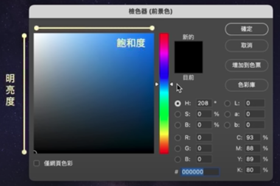
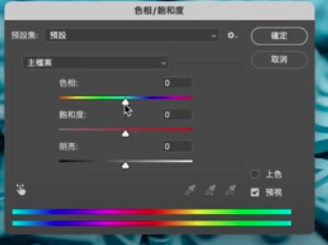

Colors

## Terms

HSB:

​	Hue Saturation Brightness

H: strength, from weak to strong

S: Fullfillness, from fade to fresh

B: Brightness, from dark to light 

## Tools

## Principle

### 60-30-10

60:  主題色

 - 傳達情緒感受
    - 藍：穩定, 寧靜等
    - 綠：自然, 和平等
    - 紅：熱情, 積極等
    - 黃：歡樂, 愉快等
    - 紫：高貴, 神秘等
 - 產成空間感
   - 中性色：白色, 黑色, 灰階

30: 次要 

  * 創造氛圍
    * 單色調
    * 近似色
    * 三分法
  * 引導視線
    * 互補色
    * 飽和度對比
    * 明暗度對比

10: 點綴性，強調

* 視覺焦點
  * 飽和度高，對比強烈
* 功能性
  * 綠：安全成功
  * 黃：提高注意
  * 紅：警示和危險
* 文字標題
  * 清晰易讀，對比度高

## 配色靈感來源

* 生活環境

* www.stocksy.com/color

  search by color -> pick favorite pictures

* www.pinterest.com

  search 'color palette'

* color.adobe.com

  * Drag&drop  picture -> color analysis

## Tools

### 色相環 color wheel

從主要色找出次要色

www.canva.com/colors/color-wheel

​	\1. Pick a color

​	\2. Choose a color combination

​	\3. Use this color combination

文字與背景對比要足夠

​	可暫時去除顏色，是否有足夠明度差異

color.adobe.com/create/color-contrast-analyzer

 
