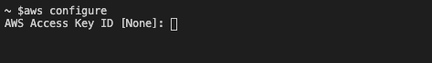
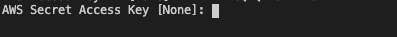
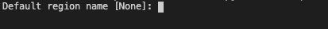
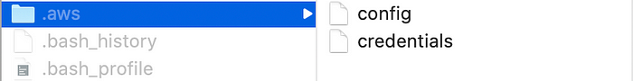
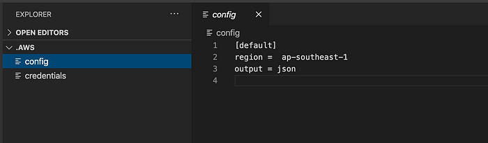
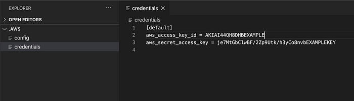

# AWS Client

To install **“AWS Client”** on your system please try to run the following command.

```
brew install awscli
```

once you have installed the **AWS client** to **verify** please type the following command on the terminal

```
aws configure
```

Then you will see the following prompt then input your **AWS Access Key ID**

```
for example: 
AWS Access Key ID [None]: AKIAI44QH8DHBEXAMPLE
```



Once you hit **enter/return** then you will see the following prompt then you need to input **AWS Secret Access Key**

```
for example: 
Secret Access Key [None]: je7MtGbClwBF/2Zp9Utk/h3yCo8nvbEXAMPLEKEY
```



Once you hit **enter/return** then you will see the following prompt then you need to input **Default region name**

```
for example:
Default region name [None]: ap-southeast-1
```



Once you hit **enter/return** then you will see the following prompt then you need to input **Default output format**

```
for example:
Default output format [None]: json
```

After that, you can check **.aws directory** under your username as shown in the following screenshot

**Note: .aws** is a *hidden* directory



If you open **config file** you will see the following lines



If you open **credentials file** you will see the following lines



We are done with the **AWS Client** Setup 👏👏👏