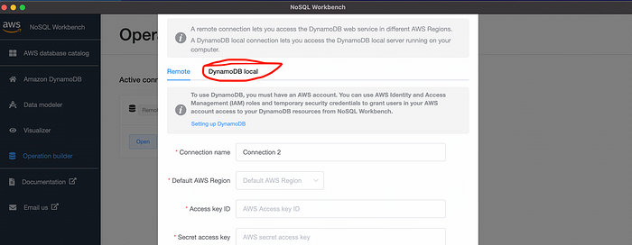
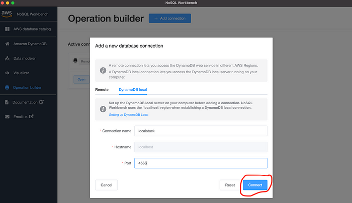
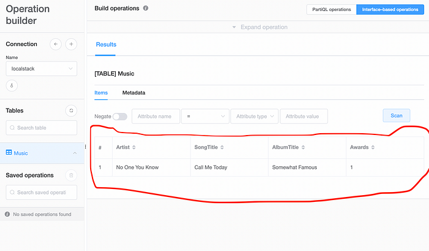

# DynamoDB

# Prerequisites

## Setting Up Docker and Kitematic MacOS/Windows

#### Installation/Setting Up Docker, Kitematic and VirtualBox MacOS/Windows

### Docker Desktop 3.6.0

2021-08-11

> Download Docker Desktop
>
> 
>
> [Mac with Intel chip](https://desktop.docker.com/mac/stable/amd64/67351/Docker.dmg) | [Mac with Apple chip](https://desktop.docker.com/mac/stable/arm64/67351/Docker.dmg)

## Install AWS Client

To install **“AWS Client”** on your system please try to run the following command.

```
brew install awscli
```

once you have installed the **AWS client** to **verify** please type the following command on the terminal

```
aws configure
```

# Running

There are 2 ways to start local server: **LocalStack** or **Aws DynamoDB-local**

**LocalStack** covers wider range of aws cloud services, including:

[See this list](https://docs.localstack.cloud/user-guide/aws/feature-coverage/)

## LocalStack

**docker**

```
$ docker run \
  --rm -it \
  -e DYNAMODB_SHARE_DB=1 \
  -p 4566:4566 \
  -p 4510-4559:4510-4559 \
  localstack/localstack
  
$ docker run --rm -it -e DYNAMODB_SHARE_DB=1 --name localstack_main -p 4566:4566 -p 4510-4559:4510-4559 localstack/localstack:latest

X----- 
docker run -e GATEWAY_LISTEN=0.0.0.0:4566  -p 4572:4572 -p 4566:4566 -e DYNAMODB_SHARE_DB=1 -e SERVICES=s3,dynamodb localstack/localstack:latest
----X


```

This will run a container exposing three ports:

- `4572` running S3
- `4569` running DynamoDB
- `8080` running Localstack's status dashboard

**docker compose -1 (version 3.0)**

```yaml
 version: '3.0'
 services:

   localstack:
     image: localstack/localstack:latest
     environment: 
       - AWS_DEFAULT_REGION=ap-southeast-1
       - EDGE_PORT=4566
       - SERVICES=dynamodb
       - KINESIS_PROVIDER=kinesalite
       - DYNAMODB_SHARE_DB=1
         ports:
       - '4566:4566'
         volumes:
       - "${TMPDIR:-/tmp/localstack}:/tmp/localstack"
       - "/var/run/docker.sock:/var/run/docker.sock"
```

**docker compose -2 (version 3.8)**

```yaml
 version: "3.8"

 services:
   localstack:
     container_name: "${LOCALSTACK_DOCKER_NAME-localstack_main}"
     image: localstack/localstack:latest
     container_name: localstack
     ports:
       - "127.0.0.1:4566:4566"            # LocalStack Gateway
       - "127.0.0.1:4510-4559:4510-4559"  # external services port range
         environment:
       - DEBUG=${DEBUG-}
       - DOCKER_HOST=unix:///var/run/docker.sock
       - DYNAMODB_SHARE_DB=1
         volumes:
       - "${LOCALSTACK_VOLUME_DIR:-./volume}:/var/lib/localstack"
       - "/var/run/docker.sock:/var/run/docker.sock"
```

## Aws DynamoDB-local

**Docker**

```
docker run -p 8000:8000 -e DYNAMODB_SHARE_DB=1 amazon/dynamodb-local
```


**Docker Compose**

The downloadable version of Amazon DynamoDB is available as a Docker image. For more information, see [dynamodb-local](https://hub.docker.com/r/amazon/dynamodb-local).

DynamoDB local is available as a [download](https://docs.aws.amazon.com/amazondynamodb/latest/developerguide/DynamoDBLocal.DownloadingAndRunning.html#DynamoDBLocal.DownloadingAndRunning.title) (requires JRE), as an [Apache Maven dependency](https://docs.aws.amazon.com/amazondynamodb/latest/developerguide/DynamoDBLocal.DownloadingAndRunning.html#apache-maven), or as a [Docker image](https://docs.aws.amazon.com/amazondynamodb/latest/developerguide/DynamoDBLocal.DownloadingAndRunning.html#docker).

If you prefer to use the Amazon DynamoDB web service instead, see [Setting up DynamoDB (web service) ](https://docs.aws.amazon.com/amazondynamodb/latest/developerguide/SettingUp.DynamoWebService.html).

Copy the following code to a file and save it as `docker-compose.yml`.

```yaml
version: '3.8'
services:
 dynamodb-local:
   command: "-jar DynamoDBLocal.jar -sharedDb -dbPath ./data"
   image: "amazon/dynamodb-local:latest"
   container_name: dynamodb-local
   ports:
     - "8000:8000"
   volumes:
     - "./docker/dynamodb:/home/dynamodblocal/data"
   working_dir: /home/dynamodblocal
```

or If you want your application and DynamoDB local to be in separate containers, use the following yaml file.

```yaml
version: '3.8'
services:
 dynamodb-local:
   command: "-jar DynamoDBLocal.jar -sharedDb -dbPath ./data"
   image: "amazon/dynamodb-local:latest"
   container_name: dynamodb-local
   ports:
     - "8000:8000"
   volumes:
     - "./docker/dynamodb:/home/dynamodblocal/data"
   working_dir: /home/dynamodblocal
 app-node:
   depends_on:
     - dynamodb-local
   image: amazon/aws-cli
   container_name: app-node
   ports:
    - "8080:8080"
   environment:
     AWS_ACCESS_KEY_ID: 'DUMMYIDEXAMPLE'
     AWS_SECRET_ACCESS_KEY: 'DUMMYEXAMPLEKEY'
   command:
     dynamodb describe-limits --endpoint-url http://dynamodb-local:8000 --region us-west-2
```

## Startup & usage

```
docker compose up
or 
docker compose up -d
```


#### Check health

```
curl -v  http://127.0.0.1:4566/_localstack/health
```

#### create table

```
 aws dynamodb --endpoint-url=http://localhost:4566 create-table \
    --table-name Music \
    --attribute-definitions \
        AttributeName=Artist,AttributeType=S \
        AttributeName=SongTitle,AttributeType=S \
    --key-schema \
        AttributeName=Artist,KeyType=HASH \
        AttributeName=SongTitle,KeyType=RANGE \
--provisioned-throughput \
        ReadCapacityUnits=10,WriteCapacityUnits=5
```

#### verify table created

````
# aws --endpoint-url=http://localhost:4566 dynamodb describe-table --table-name Music | grep TableStatus

"TableStatus": "ACTIVE",
````

#### insert data

```
 aws --endpoint-url=http://localhost:4566 dynamodb put-item \
    --table-name Music  \
    --item \
        '{"Artist": {"S": "No One You Know"}, "SongTitle": {"S": "Call Me Today"}, "AlbumTitle": {"S": "Somewhat Famous"}, "Awards": {"N": "1"}}'
```

#### read table

```
aws dynamodb scan --endpoint-url=http://localhost:4566 --table-name Music
```

#### list tables

```
aws dynamodb list-tables --endpoint-url http://localhost:4566
```

## DynamoDB GUI Client

[Download](https://docs.aws.amazon.com/amazondynamodb/latest/developerguide/workbench.settingup.html) the [NoSQL Workbench](https://docs.aws.amazon.com/amazondynamodb/latest/developerguide/workbench.settingup.html) GUI client from the [**AWS website**](https://docs.aws.amazon.com/amazondynamodb/latest/developerguide/workbench.settingup.html) to **test** the **DynamoDB**.

###### To download NoSQL Workbench and DynamoDB local

1. Download the appropriate version of NoSQL Workbench for your operating system.

   | Operating system | Download link                                                |
   | :--------------- | :----------------------------------------------------------- |
   | macOS            | [Download for macOS](https://s3.amazonaws.com/nosql-workbench/WorkbenchDDBLocal-mac.zip) |
   | Windows          | [Download for Windows](https://s3.amazonaws.com/nosql-workbench/WorkbenchDDBLocal-win.exe) |
   | Linux**          | [Download for Linux](https://s3.amazonaws.com/nosql-workbench/workbenchDDBLocal-linux.run) |

Once you installed [NoSQL Workbench](https://docs.aws.amazon.com/amazondynamodb/latest/developerguide/workbench.settingup.html) Then try to open it you will see the **dashboard screen** as shown in the following **screenshot**.


Try to **click** on the **Amazon DynamoDB** **launch button.** It will show you another dashboard screen click on the **Operation builder**


Then click on the **Add connection** Button as shown below


**Click** on **DynamoDB Local Tab** as shown below



Input

**Connection name :**

```
localstack
```

**Port:**

```
4566
```



If you connected to the DynamoDB Local then you will see the following screen. Click on the **Open** button as shown below


Then you can see the table **Music** we have created before. Then click on the table.


If you **click** on the **Music** then you can see the **inserted data** in the **Table** as **shown below**



We are done with the **Localstack** testing with **DynamoDB**
