# Should you use Serverless for your API?

## Serverless functions and container comparison using load testing


[Aurélien BETTINI](https://medium.com/@aurelien.bettini?source=post_page-----cb28ce38632e--------------------------------)


Photo by [Pablo García Saldaña](https://unsplash.com/@pagsa_?utm_source=medium&utm_medium=referral) on [Unsplash](https://unsplash.com/?utm_source=medium&utm_medium=referral)

Should you use Serverless for your infrastructure? Or a more traditional approach like containers?

Recently, the Prime Video tech team [shared an article](https://twitter.com/zackkanter/status/1653960529634025473) explaining how they slashed their infrastructure costs by a staggering **90%** by shifting from Serverless to a more monolithic approach. Since then, we’ve been inundated with opinions defending one side or the other.

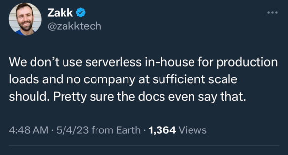

Twit from Zakk, Sr. Product Engineer [@Amazon](https://twitter.com/Amazon)

“No company at sufficient scale should [use serverless]”. Ok, but what scale are we talking about? Can my Blog API survive 1,000 more users? Or should I deploy a K8s cluster straight away?? hold on…

In this article, let’s compare a Serverless solution like **AWS Lambda** to a more traditional approach using containers, such as **AWS ECS**: What are the differences, pros, and cons?

I will be using k6 for load testing to answer a few questions: What are the latency benefits? What about pricing? etc.

# Setup

## Code

We want to test Lambda and ECS with the **same code**. Hopefully, I’ve written an article recently about building a [Serverless Express API](https://medium.com/@aurelien.bettini/serverless-api-on-aws-azure-and-gcp-deployment-and-benchmark-3ab237203178). I’m just going to reuse the code.

On the ECS side, I need to convert the Express JS code to a Docker format.

The API has two main endpoints:

- /item: connects to DynamoDB. Each request triggers a GetItems call to DynamoDB.
- /feed: simply returns a JSON response from the API.

## AWS Lambda parameters

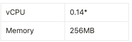

**The number of vCPUs is dependent on the memory allocated. For example, 1 vCPU is allocated for* ***1.8GB\*** *of memory.*

## ECS parameters

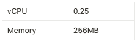

# Load testing

*There are plenty of ways to expose lambda and ECS to the internet: ALB, NLB, API Gateway. This article doesn’t provide a comparison of all the combinations. But it doesn’t impact the results significantly if the load is under 10k req/s.*

I’m using K6 to simulate the following scenarios:

- Traffic Increase: Determine the maximum number of connections the API can handle.
- Stable Traffic: Send a fixed number, X, of requests per second to observe how the API reacts, especially for latency.

Below are the architectures for both setups:

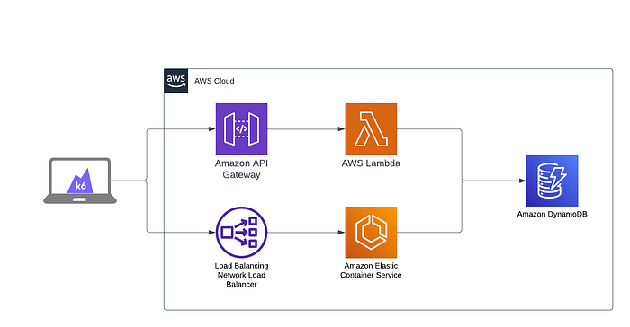

Architecture to compare serverless functions and containers

You can replace the Network Load Balancer with an Application Load Balancer; the results remain the same as long as the requests per second stay below 100,000s. In this case, we will only be testing with a maximum of 5,000 RPS, so we should be fine.

Here is the full architecture. You can find the code in the following [repo](https://github.com/aubettini/blogs/tree/main/comparison-serverless-container-with-k6).

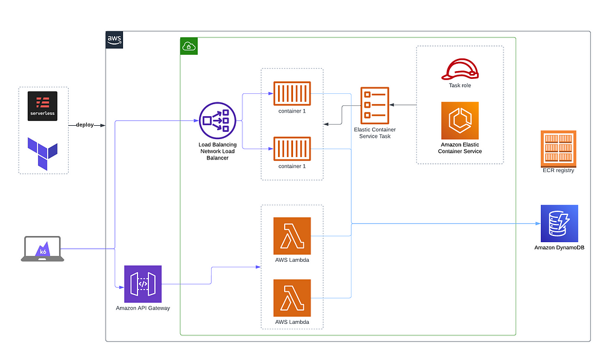

Full architecture

# Latency results

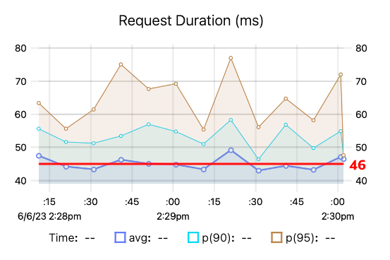

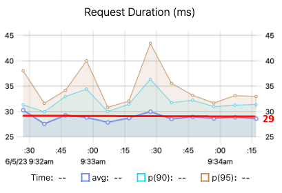AWS Lambda request duration — ECS request duration

For Lambda, the average request duration is **46ms**, compared to **29ms** for ECS. That’s a **38%** gain in latency if you are using ECS.

However, if you have predictable traffic, plenty of ways exist to keep your Lambda WARM.

- Lambda **Provisioned Concurrency: this is an expensive option if it’s enabled 24/7***
- Using CloudWatch cron to ping the function every 2–3 minutes: Costs you almost nothing.

*Keeping Provisioned Concurrency enabled 24/7 turns out to be pricier than the ECS option, so I won’t test this solution as it’s primarily beneficial when you have predictable traffic.

# Iteration results

With Lambda:

- The learning curve is pretty small.
- No need to maintain the underlying infrastructure.
- The process of deploying code is straightforward and fast.

With ECS:

- The learning curve for using this service is somewhat steep, especially if you don’t have prior experience. You need to be familiar with other services like AWS ECR, VPC, IAM before using ECS.
- The Docker image needs to be built before being deployed.
- While the process can be automated, it necessitates the creation of a CI/CD pipeline, which is an additional skill to acquire.

Utilizing AWS Lambda allows for **faster iterations** compared to ECS, which is highly advantageous if your focus is on rapidly rolling out new features.

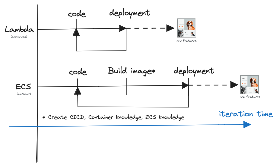

Lambda, ECS iteration schema

# Pricing results

Another aspect to consider is the cost 💸.

Lambda has a generous free tier of 1M requests/month compared to ECS.

My first idea is that the pricing will resemble the graph below:

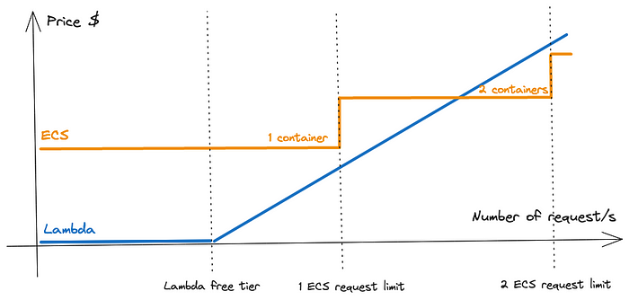

Lambda starts at $0 until you exhaust the free tier, followed by a linear increase that will eventually intersect with the ECS cost at some point.

We have all the necessary information for Lambda to make an estimation. The only missing puzzle piece is the **Maximum number of requests per second** the container can handle. If we hit the container’s limit, it’s time to scale!

## Finding the limit (K6)

To find this limit, let’s ramp up the load on our API… until it breaks 😄

```
import http from 'k6/http';
import { sleep } from 'k6';

export const options = {
  discardResponseBodies: true,
  scenarios: {
    contacts: {
      executor: 'ramping-vus',
      startVUs: 0,
      stages: [
        { duration: '200s', target: 300 },
      ],
      gracefulRampDown: '0s',
    },
  },
};
export default function () {
    http.get('<https://xxxx.execute-api.eu-west-1.amazonaws.com/feed>');
    sleep(0.2)
}
```

With this script, we “gradually” escalate the traffic from 1 VU (virtual user) to 300 over 200 seconds.

Each VU is capable of making 20 requests per second (hence the “sleep(0.05)”).

In essence, we’re scaling from 20 requests per second to approximately **2,000** requests per second.

The results look as follows:

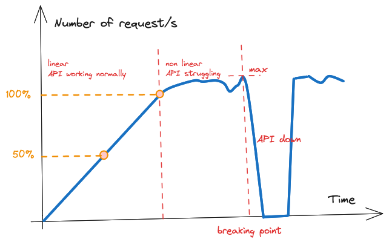

What we’re aiming to find is the boundary between the linear and non-linear regions. We divide this value by 2 to obtain a more realistic limit we can work with (50%), especially if we need to use it in a scaling policy. We need some buffer to scale smoothly!

## API without database

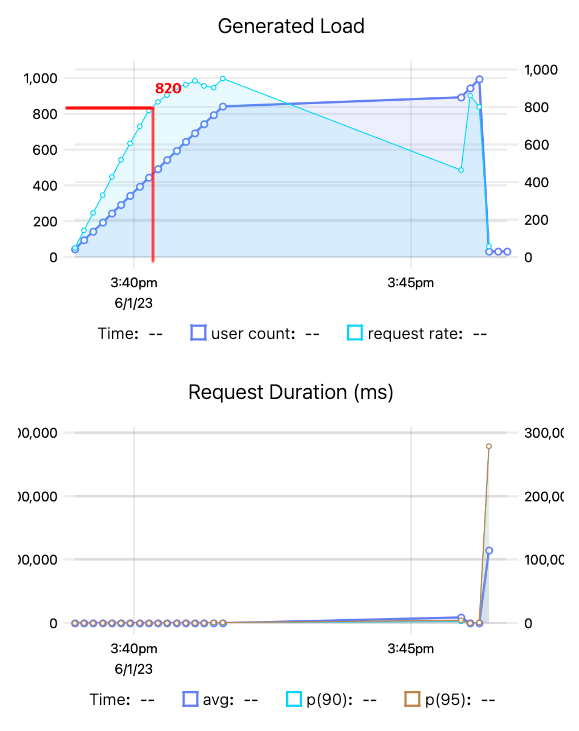

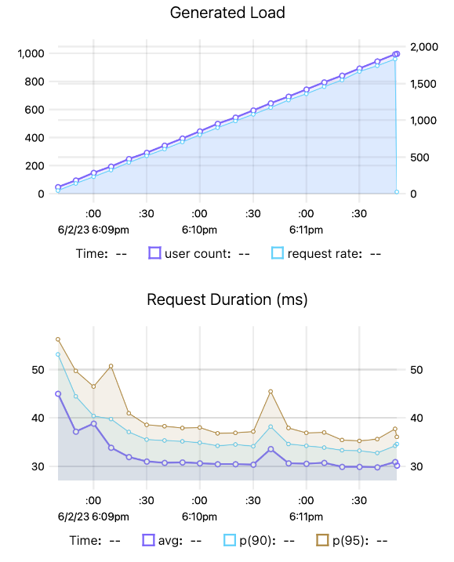

AWS ECS load testing without database / AWS lambda load testing without database

In this example, the API limit is **410 request/s: 820 divided by 2.**

## API connected to a database (Dynamodb)

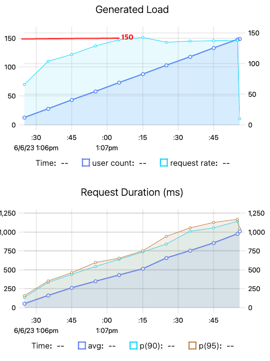

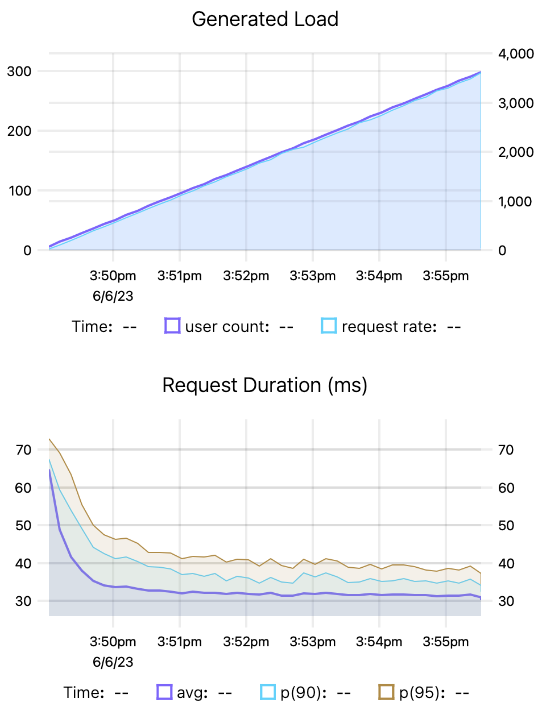

AWS ECS load testing with dynamodb / AWS lambda load testing with dynamodb

In this example, the API limit is **~75 request/s.**

## Scaling ECS cluster

For a single ECS container, we can assign a public IP to it, avoiding any additional cost.

However, if we’re aiming for a scalable solution, we need to introduce a Load Balancer (ALB, NLB) which drives the cost up.

Just to confirm the hypothesis, when executing the previous script with two containers (and a load balancer), we effectively double the load on the API: the max request rate jumps to 300, as opposed to 150 in the previous example.

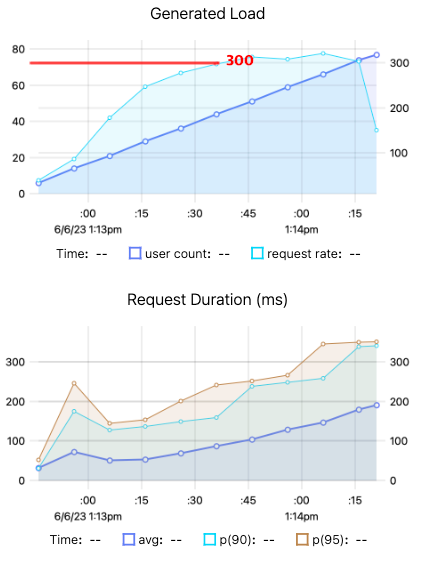

ECS load testing with 2 containers

## Results

We end up with the following graphs.

Keep in mind the endpoints are relatively simple, we don’t need to process data or make multiple API calls to the backend before returning the results. If you extend the request duration, you subsequently decrease the API’s maximum RPS (requests per second).

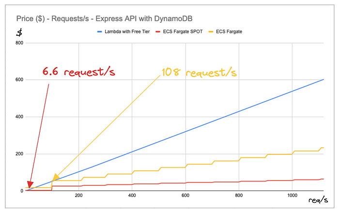

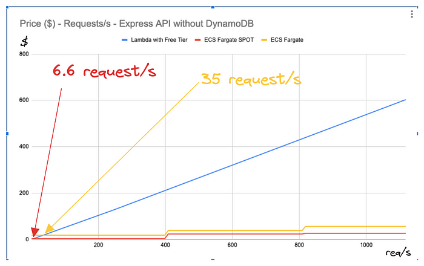

Just for comparison, OpenStreetMap was handling [10 to 20 requests per second back in 2008](https://stackoverflow.com/questions/373098/whats-the-average-requests-per-second-for-a-production-web-application). 10req/s is a significant number for an API.

# Conclusion

Just to provide some perspective, here are three combinations where using AWS Lambda won’t cost you a dime:

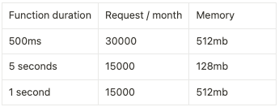

With this, you can easily set up a personal project, API, cron jobs, and batch processing for hundreds of users

**So, is my blog API safe?** Pretty much 😄 So is a startup’s infrastructure.

Unless your use case is specific, demanding 24/7 uptime, with low latency, Serverless is a rather excellent starting point. It’s a small technical debt that can be easily rectified if there’s a need to transition to containers. Additionally, as mentioned earlier, containers are interesting above **~50 req/s,** which is quite huge if you think about it.

Is it worthwhile to invest your energy in Docker and CI/CD pipelines if there isn’t a financial or technical incentive? Probably not. If a transition from serverless architecture to containerization becomes necessary, it means you’re traffic is growing and so is your business !

Here’s a quick recap:

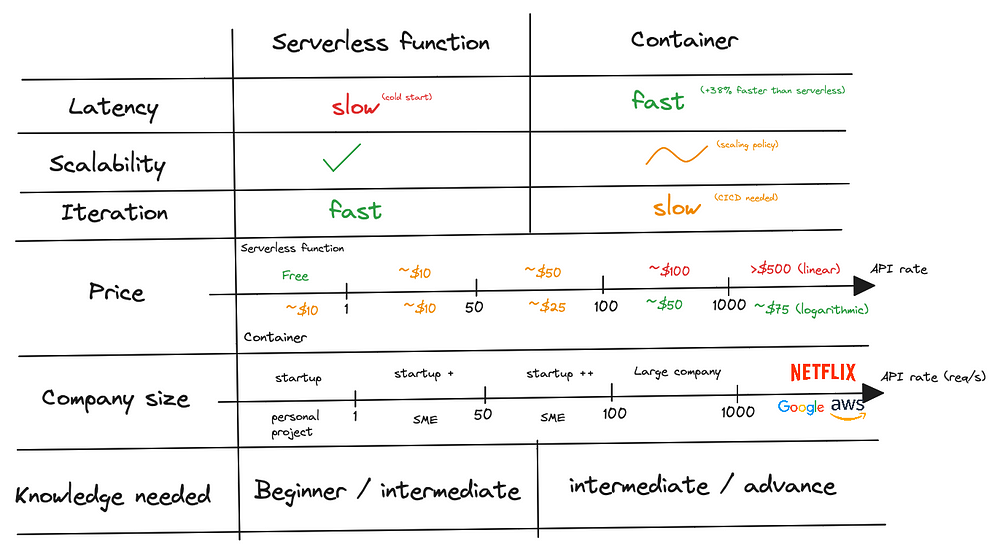

If you have any questions or comments, please message me on Twitter [@bettini_aure](https://twitter.com/bettini_aure).

# Resources

- Code: https://github.com/aubettini/blogs/tree/main/comparison-serverless-container-with-k6